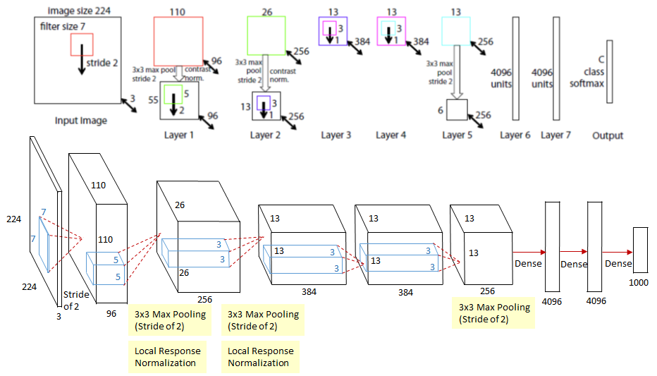
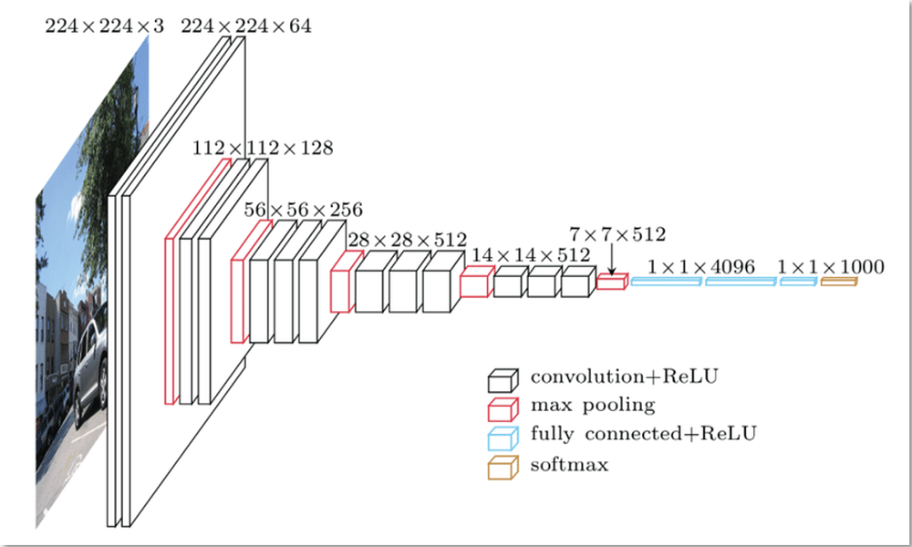
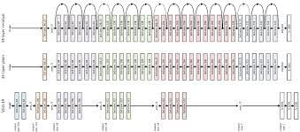

### LeNet

우편 번호나 숫자 등을 인식하기 위해서 개발

### AlexNet - 2012

ImageNet 영상 데이터 베이스를 기반으로 한 화상 인식 대회 'ILSVRC 2012'에서 수응한 CNN 구조

convolutional layer 다음에 convolutional layer가 온 점이 특이함

### ZF Net

AlexNet의 hyper-parameter를 수정하여 성능 개선
중간에 있는 convolutional layer의 크기를 늘렸다.

### VGCNet  - 2014

분류 성능은  GoogLeNet에 비해 떨어지나 다중 전달 학습 과제에서 좋은 결과가 나옴

단점: 메모리 수와 파라미터의 수가 크다

### ResNet  - 2015

기존 DNN(Deep Neural Network) 보다 layer 수가 훨씬 많은 
Deeper NN에 대한 학습(training)을 쉽게 할 수 있게 해주는 residual framework 개념을 도입

### Reference
https://blog.naver.com/laonple/220643128255
https://medium.com/coinmonks/paper-review-of-zfnet-the-winner-of-ilsvlc-2013-image-classification-d1a5a0c45103
https://www.datamaker.io/posts/35/
https://towardsdatascience.com/review-resnet-winner-of-ilsvrc-2015-image-classification-localization-detection-e39402bfa5d8