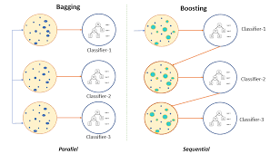
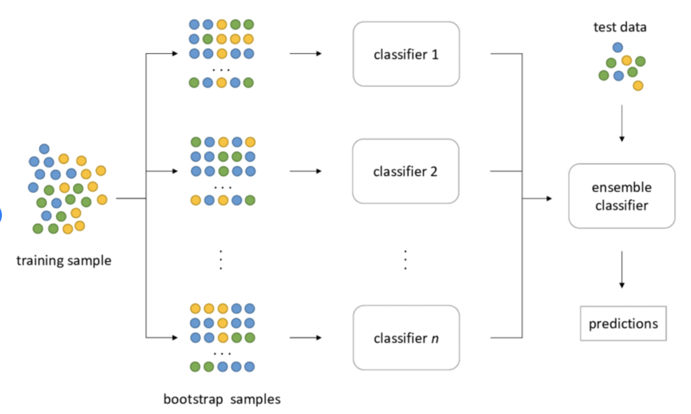

## Ensemble Learning Definition

여러개의 약한 모델들을 합치는 것. 그렇게 해서 bias, variance 를 줄이거나 accuracy를 향상시킨다.

## Types of Ensemble Learning

### 1. Bagging
   - subset 들을 모두 다르게 선별. 다 똑같은 모델들을 훈련시키고 이 중에서 prediction이 가장 괜찮은 것을 선별
   - Variance(다른 데이터 셋에 얼마나 잘 활용될 수 있는지)를 줄인다.

### 2. Boosting
   - 각 단계별로 계속 똑같은 모델을 추가 시키면서 weight를 조정한다. 그리고 최종 단계에서 weight 조정을 얼마나 한 것이 제일 좋은지 확인 한다.
   - Prediciton bias를 줄인다.(예측의 정확성)

### 3. stacking
   - 여러개의 다른 weak learner를 고려
   - 이 이질 적인 learner들이 예측을 하게 하고 예측 한 후에 meta-model을 train 시킴으로서  모델들을  합친다. 
   - 합친다는 것은 내가 이해한 바로는 각각의 모델들이 학습하고 예측한 결과중에 어떤 것이 잘 드러맞고 그렇지 아닌지 확인하고 각각의 모델들을 그때그때 사용한다는 것 같음
  
  ex) For example, for a classification problem, we can choose as weak learners a KNN classifier, a logistic regression and a SVM, and decide to learn a neural network as meta-model. Then, the neural network will take as inputs the outputs of our three weak learners and will learn to return final predictions based on it.

### Reference
https://towardsdatascience.com/ensemble-methods-bagging-boosting-and-stacking-c9214a10a205