## **ㅁ Key Concepts**

- Brokers 와 Dealers의 비교

- Limit order 와 market orders

- Limit order market에서 거래하는 메커니즘

- **Limit order**는 **make** liquidity

- **Market orders**는 **take** liquidity 

## **ㅁ Overview**

- Playeres in securities markets

- Quotes & orders

- Trading mechanics in limit order markets

## **ㅁ Playeres in securities markets**

- “Buy” side: parties who **demand** trading services
   
   - 필요로 하는 것

- “Sell” side: parties who **supply** trading services
   
   파는 사람, 제공하는 사람

**Buy side sell side에 따른 투자자 종류**

'Buy side'
   
   - 개인(retail), 기관 (wholesale)

   - 기관투자자:  
      - 뮤추얼 펀드, 연금펀드, 기업
      - mutual funds, pension funds, corporates

'Sell side'(trading services를 제공)
  - market makers  
    - 자기가 팔고 싶은 가격에 올린다.
    - 그렇게 해서 **liquidity & immediacy** 제공 (시장에 유동성을 제공) 
    - 주문을 자기가 직접하는 거여서 **자신이 위험부담**, **'Take risk'**
    - ex.optiver, imc, flow traders, Alloptions, kempen&Co, roca MARKETS
  - brokers (브로커)  / e.g eToro, Trading 212
    - trade on behalf of clients
    - Send orders to exchanges
    - **Do not trade themselves**
    - **고객을 위해서 대신 거래**, 주문 체결, 자신이 직접 거래는 안한다.
    - **돈 버는 방법**
      1. 소비자들이 **수수료**가 높은 상품들을 거래하게 한다.
           - leverage
           - CFDs (금, 은 같은거)
           - crypto (**crypto가 왜 수수료가 높은거?**)
      2. 공매도 하는 사람들에게 shares를 빌려준다
        (Lending out shares to short-sellers).
         - **“Payment for order flow:” directing order flow to
other parties for execution (and being paid for it)**
 

          - 다른 사람들에게 투자 유도를 하고 투자 받은 곳에서 돈을 받는다.
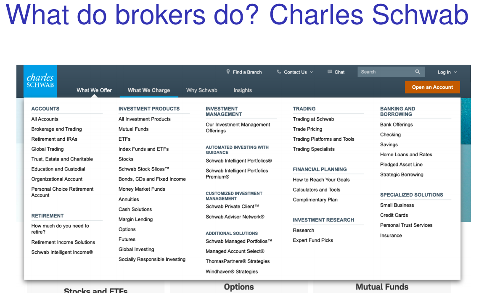

           - stocks and ETFs, Options, Mutual Funds 를 다룬다.
    - 브로커가 제공하는 이점/ price improvement
      - 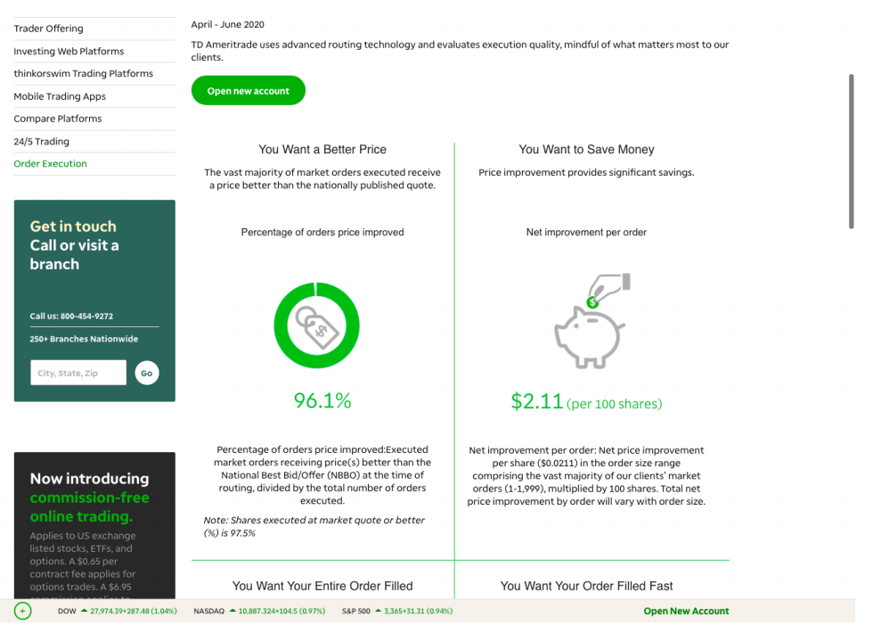
      - **price improvement**
      - How:
- 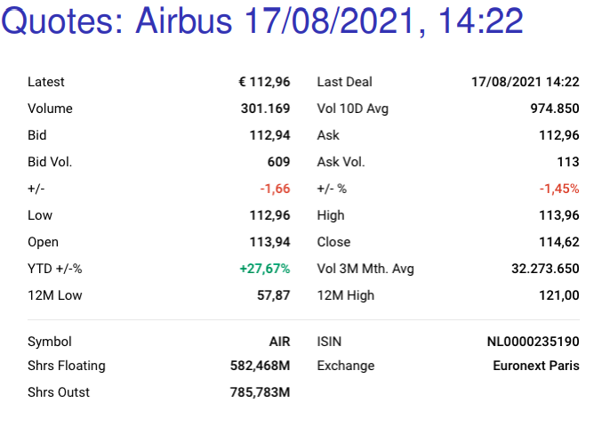
- 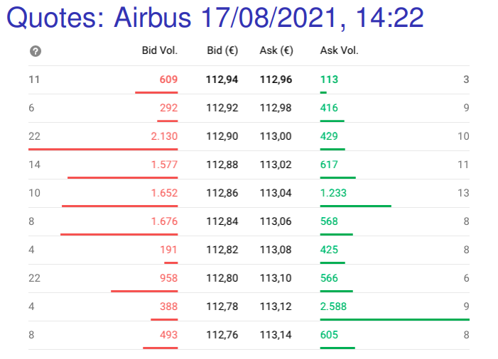
  - Vol: number of orders
        
- brokers-dealers  
    - do both (**무엇을 다 한다는 것?**)
    - 내 생각: **확인 필요**
      - 자신이 거래, 고객을 위해서 거래

- Broker vs Dealer의 차이?
  - ?????

- **Take** vs **Make**
  - 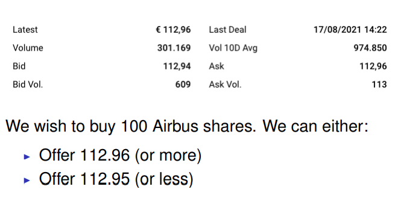
  - **Trade off: ???**
  - Market orders
    - **현재 가능한 가격**에 거래하도록 주문하는 것
    -  immediate execution vs. price uncertainty
       - 즉시 거래가 가능한 대신에 내가 어떤 가격에 사는지는 모른다.
  - Limit orders
    - instruction to trade at **best price available** provided
that it is no worse than the specified limit price
    - 지정된 가격에서 거래가 가능하게 되는 주문
    - 이점: 더 나은 가격에 거래가 가능할 수 있음
    - 단점
      - 주문이 체결되지 않을 수 있다. 주문이 느리게 체결되서 비용 발생 (Cost of delay)
      - adverse selection / picking-off risk: 
        - smarter & faster traders may trade against you precisely when you would have preferred to cancel or revise your order
        - 남들보다 잘해야 한다
  - Order Book at Market Opening process
    - start
      - 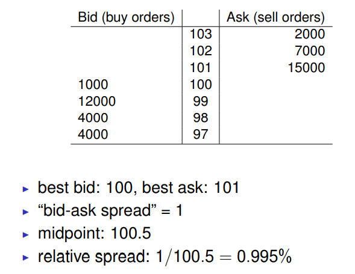
    - Sell 500 shares
      - 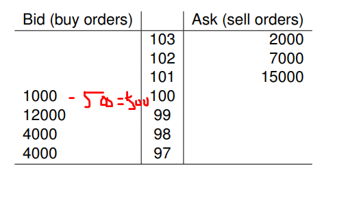
        - **bid-ask spread not altered** why ??
        - market “depth” ↓ (bid side became “thinner”)
        - market order [“takes” / “consumes”] liquidity
    - Buy 4500 shares, limit 100
      - 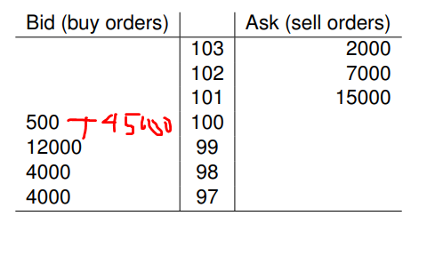
        - spread again not altered; market depth ↑
        - limit order “makes” / “provides” liquidity
          - limit은 주문량을 늘린다.
    - Sell 8000 shares, market
      - 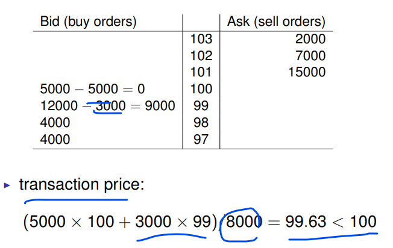
        - transaction price: (5000 × 100 + 3000 × 99)/8000 = 99.63 < 100
        - in the absence of the limit buy order at 9.32:
(500 × 100 + 7500 × 99)/8000 = 99.06 < 99.63
17 / 2
    - Sell 4000 shares, limit 99
      - 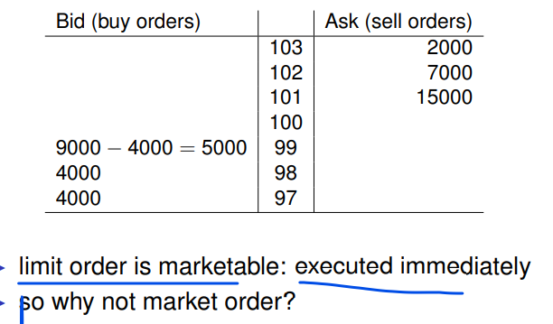
        - ????
    - Latency
      - 빨라야 한다.
      -  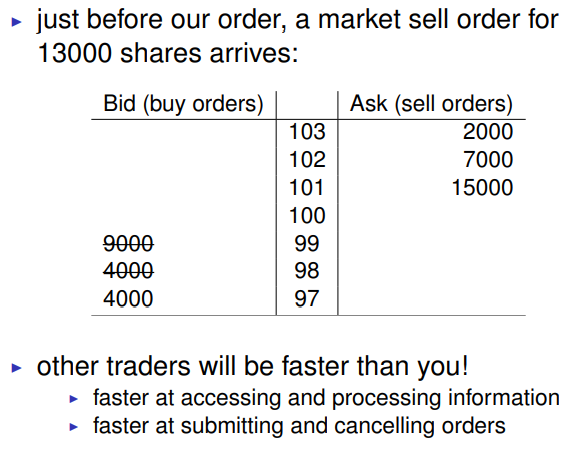

## Who makes liquidity?

- Dealers having contractual relationship with
exchange and/or issuer obliging them to provide
minimum levels liquidity, e.g.,
  - NYSE: “Designated market makers”
  - Euronext: “Liquidity providers”
- Other dealers/market makers (can) provide
liquidity too, but they have no obligation to do so
- Other professionals, e.g., high-frequency traders
- ANYBODY submitting a (non-marketable) limit
order or quote!

## How the liquidity is provided

- More liquidity is supplied
  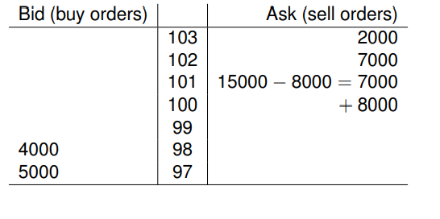
- Even more liquidity is supplied
 - 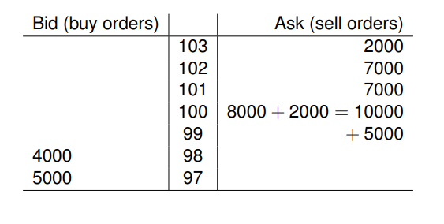 

- Buy 1600 shares limit 100
  - 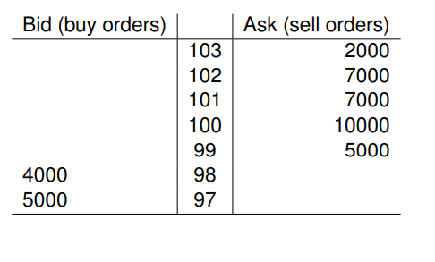
  - 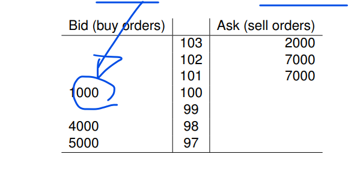
    - order is partially filled
    - non-marketable part is added to the LOB
- IOC (immediate or cancel):
  - non marketable part is canceled
    - 구매 안된거 그냥 날리는 거
  - 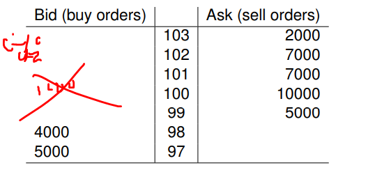
  - only 15000 shares are traded

- FOK
  - 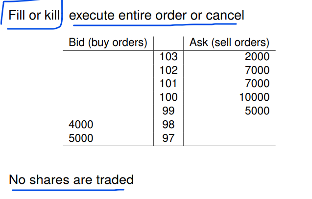
    - 다 구매 안되면 전체 날리는 것
  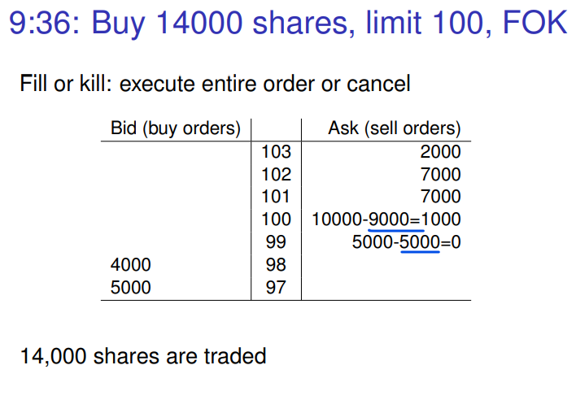

