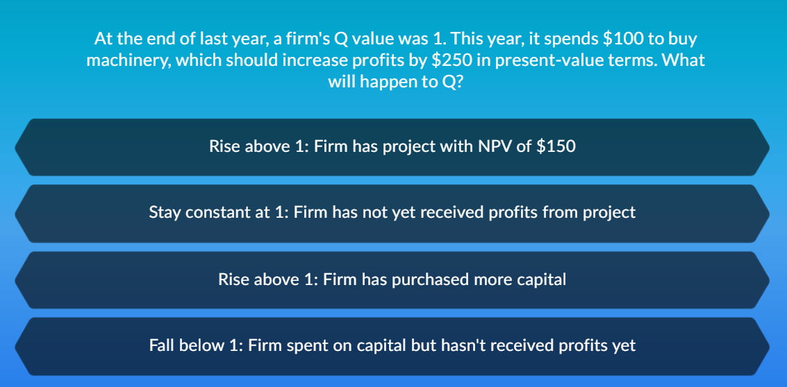
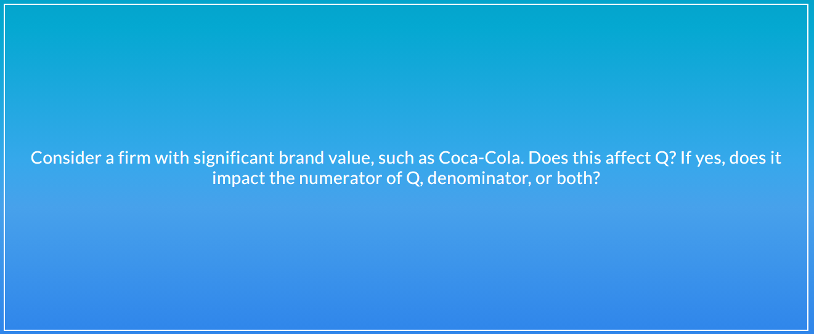

# Identifying Investmet Opportunity

## How do firms make investment decisions?
  - Common rule of thumb: NPV>0 인것 고려
  - NPV : discounted value of all progect cash flow
  - r   : Opportunity cost of capital (회사가 다른 투자를 했을 때 얻을 수 있는 가장 큰 가치)   
    - return은 **risk**를 고려해서 조정이 되어야 한다.
  - NPV > 0:
    - 프로젝트가 그 다음 차선의 투자 기회보다 더 큰 보상을 제공 
    - Value created from investment exceeds the firm's initital cost of purchasing caiptal
    - Stock market participandts should anticipate this. 그래서 투자가 시작 되기 전에도 입찰에 참여
    - **Tobin's Q** 
      - Market vlaue of firm/ Replacement cost of capital
      - 회사의 가치(시가 총액)를 capital의 가치(순자산 가치)로 나눈 것
      - 주식시장에서 평가된 기업의 가치를 기업의 총실물자본의 구입가격으로 나눈 값
        - replacement cost: price firm would have to pay on market for capital
        - **Market-book ratio**가 이것 과 비슷하고 가끔씩 대체해서 사용 되기도 한다.
      - **해석하는 방법**
        - Q>1
          - Firm generate more value using capital than other investors or firms would
          - 다른 회사들 보다 같은 capital을 사용했을 때 더 많은 자본 창출
          - 기업은 적은 비용을 들여 주식 시장에서 높은 가치를 창출 할 수 있다는 뜻. 
          - 그렇기에 Q가 높다는 것은 주식시장에 있어서 과대평가가 된다고 해석할 수도 있다.
            - internal value of capital higher than what market willing to pay
            - Ex. Shipping firm with Q of 1.5 can buy new truck for 100 and use it to generate NPV of 50
              - capital * (Tobin Q - 1) 만큼 NPV 생김
          - 기업은 기업의 가치를 높이기 위해 투자를 더 할 것이다.
        - Q<1
          - Wasting some capital, better off selling assets
          - 자본 활용을 너무 못한 다는 뜻
          - 기업은 감소하는 자본을 대체하지 않을 것이다.
        - Q=1
          - 기업은 최적자본량을 달성한 것이다.
        - 여기서 **분자(numerator) = firm's market cap + debt**
        - **분자(numerator) = 시장 총액의 가격+ 부채**
          - 여기서 **debt**도 **반드시 시장의 가치를 사용**해야 하는데 종종 book value로 사용 된다.
        - **분모(denumerator)** = **book** value of total assets or PP&E
        - **분모(denumerator)** = **총 자산의 가격**
          - book value: 회사가 *그 자산을 사기위해 시장에서 지불한 가치*
        - **Q= (시가총액+debt)/total asset** ( 총자산은 장부가격으로 한다. 추정가격 x)
      - Q는 투자심리나 성장 가능성을 나타내는 지표와 적절히 사용하면 활용 가능 성이 높다.

## 문제

**정답 1**
    - 여기서 궁금한 것은 NPV의 상승이 market cap을 증가시키는 것인가 이다.
    - 물론 npv의 상승의 주가의 상승에 기여를 해서 market cap을 상승시킬 수 있지만 이는 간접적인 영향으로 인해서 증가한 것이다. 그렇기 때문에 1번이 왜 맞는지에 대해서 확신이 없다.  

  - numerator(분자)는 market cap + debt를 합친 것인데 내 생각에는 brand value는 분자에 포함이 된다. 브랜드는 무형의 중요한 자산이다. 코카콜라의 판매에 있어서 브랜드는 상당한 비중을 차지한다. 이는 팹시와 코카콜라가 맛이 큰 차이가 없지만 코카콜라가 브랜드 인식으로 인해서 더 잘 팔리는 것을 통해서 알 수 있다. 그렇기 때문에 brand 가치는 분자에 포함이 된다.
  
  - denumerator(분모)는 내 생각에는 회계적 장부에서 나타나는 가치를 의미하는 것 같다. 브랜드가 무형의 자산이기 때문에 회계적 장부에 나올수 없기에(?) 분모에는 변화가 없다.
  
  - 정리하면 분자는 올라가고 분모는 그대로 이다.   

# Intro to Q Theory
