# Identifying Investmet Opportunity

여기서는 회사가 새로운 투자를 할지 말지를 무엇을 보고 결정하는 지 에 대해서 알아보겠다. 가장 대표적으로 사용되는 것은 Tobin's Q 이다. 이 지표는 회사의 운영 상태를 나타낼 수 있는 지표이다.

## How do firms make investment decisions?
  - Common rule of thumb: NPV>0 인것 고려
  - NPV : discounted value of all progect cash flow
  - r   : Opportunity cost of capital (회사가 다른 투자를 했을 때 얻을 수 있는 가장 큰 가치)   
    - return은 **risk**를 고려해서 조정이 되어야 한다.
  - NPV > 0:
    - 프로젝트가 그 다음 차선의 투자 기회보다 더 큰 보상을 제공 
    - Value created from investment exceeds the firm's initital cost of purchasing caiptal
    - Stock market participandts should anticipate this. 그래서 투자가 시작 되기 전에도 입찰에 참여
    - **Tobin's Q** 
      - Market vlaue of firm/ Replacement cost of capital
      - 회사의 가치(시가 총액)를 capital의 가치(순자산 가치)로 나눈 것
      - 주식시장에서 평가된 기업의 가치를 기업의 총실물자본의 구입가격으로 나눈 값
        - replacement cost: price firm would have to pay on market for capital
        - **Market-book ratio**가 이것 과 비슷하고 가끔씩 대체해서 사용 되기도 한다.
      - **Tobin's Q 해석하는 방법**
        - Q>1 
          - Has **positive NPV opportunity**
          - Firm generate more value using capital than other investors or firms would
          - 다른 회사들 보다 같은 capital을 사용했을 때 더 많은 자본 창출
          - 기업은 적은 비용을 들여 주식 시장에서 높은 가치를 창출 할 수 있다는 뜻. 
          - 그렇기에 Q가 높다는 것은 주식시장에 있어서 과대평가가 된다고 해석할 수도 있다.
            - internal value of capital higher than what market willing to pay
            - Ex. Shipping firm with Q of 1.5 can buy new truck for 100 and use it to generate NPV of 50
              - capital * (Tobin Q - 1) 만큼 NPV 생김
          - 기업은 기업의 가치를 높이기 위해 투자를 더 할 것이다.
        - Q<1
          - Wasting some capital, better off selling assets
          - 자본 활용을 너무 못한 다는 뜻
          - 기업은 감소하는 자본을 대체하지 않을 것이다.
        - Q=1
          - 기업은 **최적자본량을 달성**한 것이다.
        - 여기서 **분자(numerator) = firm's market cap + debt**
        - **분자(numerator) = 시장 총액의 가격+ 부채**
          - 여기서 **debt**도 **반드시 시장의 가치를 사용**해야 하는데 종종 book value로 사용 된다.
        - **분모(denumerator)** = **book** value of total assets or PP&E
        - **분모(denumerator)** = **총 자산의 가격**
          - book value: 회사가 *그 자산을 사기위해 시장에서 지불한 가치*
        - **Q= (시가총액+debt)/total asset** ( 총자산은 장부가격으로 한다. 추정가격 x)
      - Q는 투자심리나 성장 가능성을 나타내는 지표와 적절히 사용하면 활용 가능 성이 높다.

## 문제

**정답 1**
    - 여기서 궁금한 것은 NPV의 상승이 market cap을 증가시키는 것인가 이다.
      - 물론 npv의 상승의 주가의 상승에 기여를 해서 market cap을 상승시킬 수 있지만 이는 간접적인 영향으로 인해서 증가한 것이다. 그렇기 때문에 1번이 왜 맞는지에 대해서 확신이 없다.  
    - Market cap =  price of stock x the number of stock

  - numerator(분자)는 market cap + debt를 합친 것인데 내 생각에는 brand value는 분자에 포함이 된다. 브랜드는 무형의 중요한 자산이다. 코카콜라의 판매에 있어서 브랜드는 상당한 비중을 차지한다. 이는 팹시와 코카콜라가 맛이 큰 차이가 없지만 코카콜라가 브랜드 인식으로 인해서 더 잘 팔리는 것을 통해서 알 수 있다. 그렇기 때문에 brand 가치는 분자에 포함이 된다.
  
  - denumerator(분모)는 내 생각에는 회계적 장부에서 나타나는 가치를 의미하는 것 같다. 브랜드가 무형의 자산이기 때문에 회계적 장부에 나올수 없기에(?) 분모에는 변화가 없다.
  
  - 정리하면 분자는 올라가고 분모는 그대로 이다.  

# Intro to Q Theory

앞의 부분에서는 Tobin's의 Q 가 어떻게 사용되는지 간략히 알아보았다. 이번에는 Tobin's Q가 어떻게 구성이 되는지 간략히 알아보겠다.

## Brief overview of Q theory

- K: capital
  - Captial depreciates at annual rate δ
- δ: discount rate 
- I: investment amount (Spend I on new assets)
- Firm's value
      -  v_0=αk_1∕(1+r)
      -  k_1 = I_0 + (1-δ)K_0
- (I_0/k_0)^2 = Capital adjustment cost 
    - Ex: Operating more machines requires increasing amount of attention from mangement.
      - capital의 양이 많아지면 많아질 수록 or 회사 사이즈가 커질 수록 관리비가 기하 급수적(?)으로 늘어난다.

## Firm's maximization problem

- Firm choose I_0 to maximize:
  -   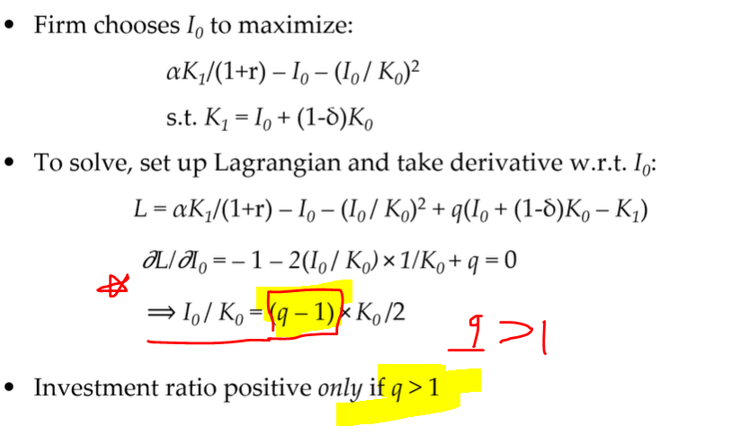
      -   Q>1 보다 커야만 투자를 한다.

- 문제
  - 
    - 독립변수는 market cap + debt이다.
    - 종속변수는 k_0에 영향을 미치는 요인이다.

## A few technical details
  - In Maximization problem
    - q = *(∂V_1)/(∂K_1)* <<< why?? : ∂V_1 refers to changes of market value
      - Interpretation can be 
        - ' How much market values changes with the one extra unit of capital'
      - This makes investment depends on the **marginal** profits from one extra unit of captital.
      - q is measured as average value of capital
        - Total market value/total capital cost
      - Hayashi Theorem
        - under same plausible condition
          - average q = marginal q
  - When there is **no adjustment costs**
    - 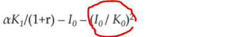
    - Maximization problem
      - 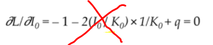
      - q = 1 **always**

#  Evidence on Q Theory

Q Theory가 실제로 적용이 되는지 확인 할 것

1. 투자와 Q는 양의 상관 관계
2. Q가 유일한 변수 (다른 변수는 영향 ㄴㄴ)

## 연구 결과 밝혀진 문제들 Lack of empirical evidence

1. Q가 투자의 변화를 설명을 잘 못한다.(R^2가 값이 낮음)
2. **Adjustment costs** 가 **클 때**만 Regression estimates of Q가 영향이 있는 것으로 나타났다.
3. Q뿐만 아니라 **많은 다른 변수**들이 *투자와 연관성이 있는 것*으로 들어남
  
요약하면 Q는 coporate investment에 있어서 중요하지만 다른 factor들이 더 중요하다.

## Hypothesis 1: Mesurement error in Q

- *Measurement error could explain* **lack of empirical evidence**
- **측정 오류**가 Q 이론이 실제적으로 적용이 안되는 부분을 **설명**할 수 있음
    - OLS regression에서 measurement error가 있으면 coefficient 가 거의 0에 가까워 진다.(Q 변수가 설명력이 없어진다는 뜻, 그리고 R^2 도 줄어든다.)
    - Bias can also lead to significant coefficients on other variables(이거 이해 x)
- **Q는 measurment error가 있다.** 왜 measurement error가 있는지에 대한 이유로는
  - market value of equity가 투자기회(investment opportunity) 말고도 다양한 요인들에 의해서 영향을 받기 때문이다.
  - Q는 **debt**의 **시장가격**에 기초해야 하는데 book value가 종종 사용된다.
  - book value of assets 는 과거의 가격에 기초했는데 이는 현재의 replacement costs를 반영하지 못할 수 있다.
  
- *Measurement error를 고려한 새로운 실험 결과*
  - Erickson and Whited (2000) employ advanced statistical thechinique to remove measurement error from Q
    - 결과
      - R^2 more than doubles after accounting for measurement error
      - Coefficient estimates on Q are substantially larger than simple OLS
      - Estimates of other variables (e.g cashflosw) small and insignificant
      - 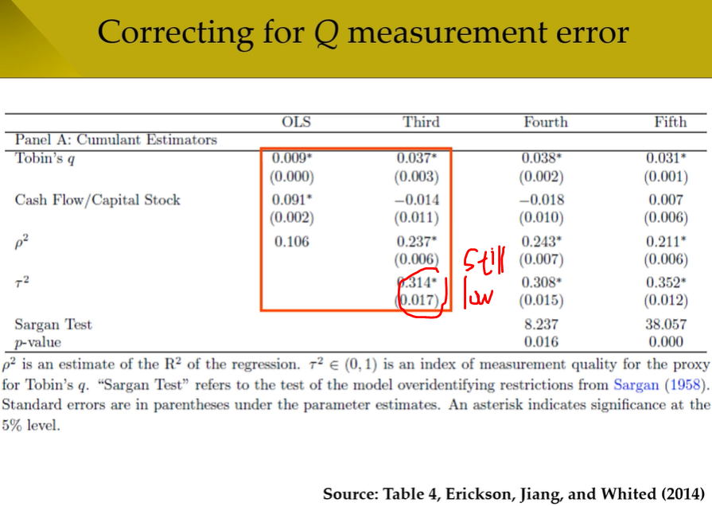
  - Peters and Taylor (2017) find that Q work much better when intangible assets are included
    - 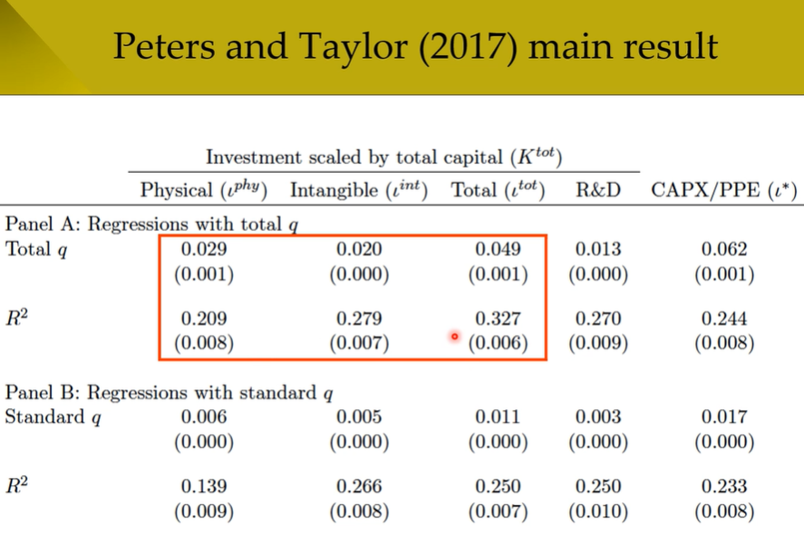  
- 문제
   

## Hypothesis 2: Financial constraints

- Firms must invests C_0 up front, and receive cashflows in future
  - But where doese initial cash C_0 come from?
  - **이게 왜 문제인거?? cash랑 어떻게 연관이 되는거지? marcap?**
      - 투자를 해야 매출도 오르고  market capital 도 오르니까 연관이 되어있다.

    - Young firms start with almost no cash, and are also not profitable
      - Main way to fund investment is raising external financing
      - mature firms typically hold cash and are profitable, but may face  very large upfront investment costs.
  - If a firm has difficulty raising external financing, it may pass up investment opps **even when Q is high**
- 정리하면 Starting firm한테는 Q가 높아도 financing 받는거 아니면 돈 벌기가 힘들기 때문에 Q이론이 적용되지 않을 수 있다는 말이다.
  - 그렇다면 왜 financing이 어려울까? 왜 financing이 costly할까?
    - Pecking order theory predicts that investment is cheaper to finance using internal funds(i.e.,cash) than external/ 외부에서 돈 받는 것 보다 내부 회사 돈 쓰는게 더 싸다
      - Internal financing이 더 싼 이유
        - **Asymmetric info**
          - Firm's managers know its condition better than external investors
          - 회사의 매니저는 외부투자자보다 더 많은 정보를 가지고 있음
            - 회사가 external financing 즉 주식을 팔아서 자금을 충당하려고 한다면 이는 외부 투자자들에 있어서 회사의 미래가 어둡다고 생각하게 할 수 있다.
            - 회사가 주식을 매각하지 않고 cash를 사용하면 외부 투자자들은 회사가 안정적이다라고 생각할 수 있다.
          - 그래서: Firms with volatile cashflows should build up internal funds, to ensure sufficient liquidity during bad years.
            - 회사는 안정적인 현금 흐름을 확보하는 것이 중요하다. 

# Example of Precautionary Savings

-Simple example
  - 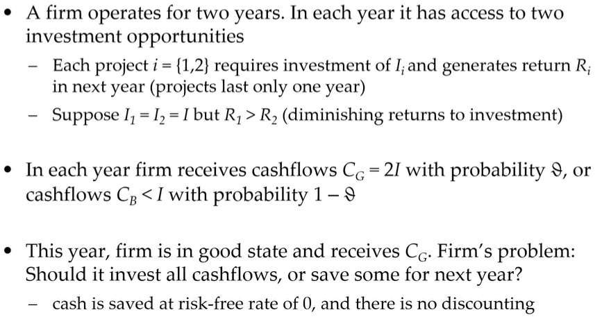
    - 조건 
      - 이번 년도에는 회사는 C_G를 받은 상태
      - 투자는 같은데 R_1> R_2로 올해가 수익률이 더 높다.
      - C_G : cashflow in good states (투자 후 회수한 돈)
      - C_B : cashflow in bad states (C_B< *I* 투자한 것 보다 회수 한 돈이 적음)
      - C_S : cash saved
      - *I*   : 쓴 돈/투자한 돈
      - R_1 : Year 1의 이익
      - R_2 : Year 2의 이익
      - δ   : C_G(=I) 를 받을 확률
      - 1-δ : C_B(< I) 를 받을 확률
    - 문제: 현금을 모두 투자? or Save some?
  - 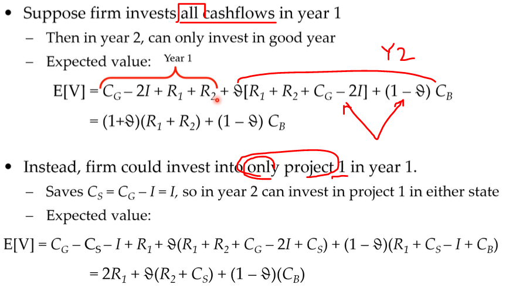
    - 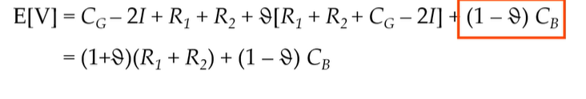
      - C_G-2I+R1+R2
        - 좋은 상태에서 얻은 현금- 두 개의 프로잭트에 쓴 돈(2I) + 리턴(이게 순 수익) + δ(R_1+ R_2 + C_g - 2I) + (1-δ)C_B [Return이 없음] 
    - 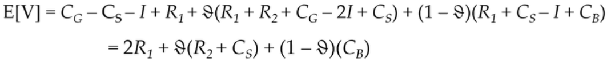 
      - C_S = C_G - I
        - 내가 좋은 상황에서 투자를 한다면 얻을 수 있는 수익 
        - C_S   
  - 어떤걸 할지 판단
    - 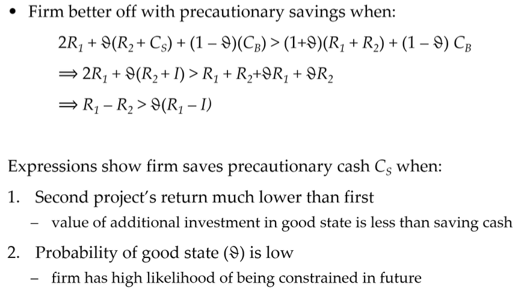 

# Evidence on Financial contraints
- 

- Fazzari, Hubbard, and Petersen (1988) provide early evidence that **financial constraints affect investment** 

- Split firms into three groups based on dividend payouts
  - Firms that **pay dividends instead of saving cash** are likely **not financially constrained**
  - Test relationship between **annual cashflows and investment across each subset of firms**

- Data shows that **effect of cashflows** is **strongest** for most **financially constrained firms**, **weakest** for **least constrained**
  - Indicates that investment depends on availability of internal funds

- Very important one!!!
  - 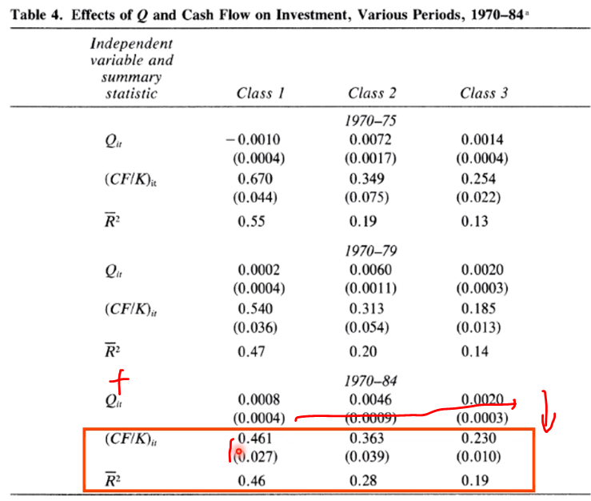
  - Interpretation
    - CF/K is largest and most significant at class1 with value of 0.461, and it gradually decreases at other classes
    - Same thing with R squred
    - So. Cash flow also matters!!!

    ## Class 1 2 3 무슨 차이?

## Kaplan and Zingales (1997) critique 

- Empirically **refute** FHP (1988)’s results, showing that financial constraints may not affect investment-cashflow sensitivity

- Re-classify firms based on discussion of constraints in 10-K filings
  - many “constrained” firms mention no problems raising funds

- Find cashflows associated with investment across all firms, regardless of financial constraints
  - indeed, association strongest for least constrained firms

- Additional problem with FHP (1988): Cashflows can be correlated with investment opps, thus biasing regression estimates

## Constraints and precautionary savings

- Another issue with FHP (1988): If firms engage in *precautionary savings*, then *estimated effect of cashflows could be **negative***!
  - reason is that constrained firms *invest less* when cashflows high, to fund more investment when cashflows low
  - cashflows depend on both current and future investment opps

- Almeida et al. (2004) develop new theory showing constrained firms should save more out of annual cashflows
  - “Cashflow sensitivity of cash”: Test relationship between cash holdings and cashflows
  - association likely unbiased by error in measuring investment opps

## Almeida et al. (2004) main result

- 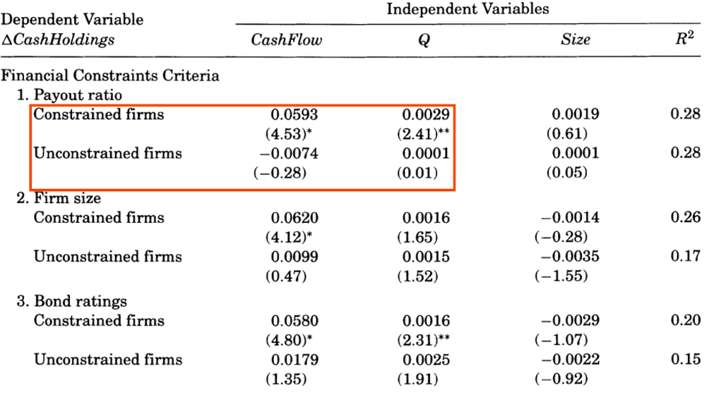
  - Increase in cash flow lead to increase in cash savings 

## More recent evidence

- Newer papers exploit exogenous shocks to corporate liquidity or internal funds
  - Results show that financial constraints matter for investment

- Lamont (1997) examines investment following 1986 oil price crash
  - finds that oil companies cut investment in their non-oil subsidiaries
  - oil price crash exogenous to these subsidiaries’ investment opps

- Rauh (2006) shows that firms that must increase contributions to employee pension fund also cut Capex
  - exploits law requiring firms with pension assets just below threshold to raise contributions
  - RDD design compares firms just above and below threshold

## Rauh (2006) RDD design

- 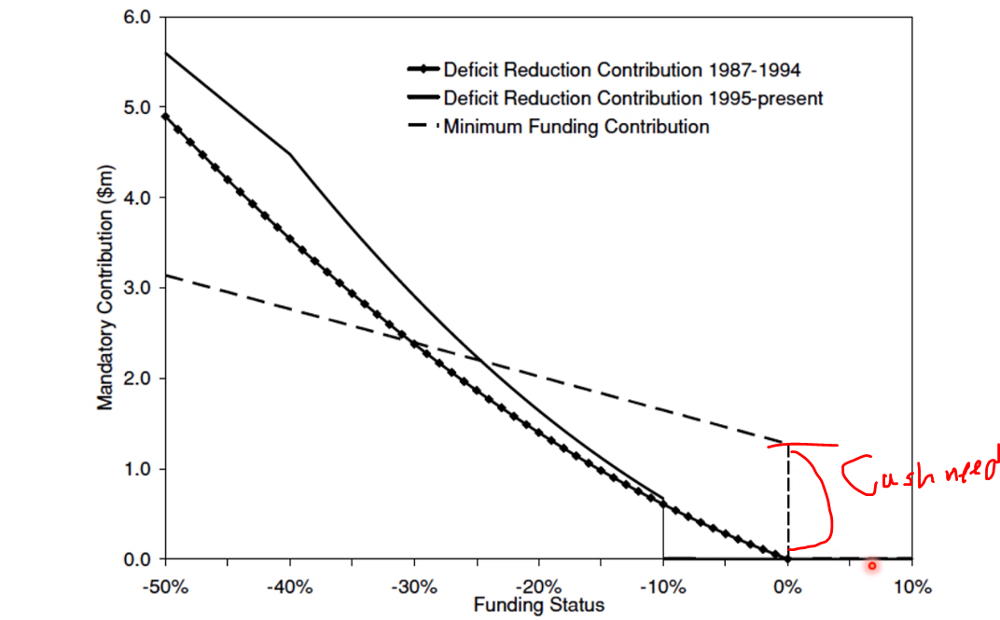  
  - You have to spend cash when

## Rauh (2006) main result

- 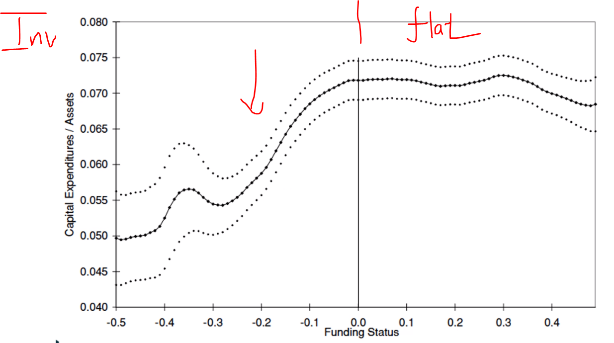

>> Financial status do matter for the investments
>> Companies do engagein precuasinary savings

# Cash holdings: A challenge to theory

- Public firms’ cash holdings have risen dramatically since 1980s
in U.S., level is higher than any point in past century except WW2

- Policymakers highly frustrated that firms are hoarding cash instead of investing to create jobs, growth
  - central banks have driven savings rates on cash to record lows

- Explanations that could reconcile this trend with traditional investment theories:
  - Positive NPV investment opps less frequent than before 1980
  - Financial constraints pose greater threat since 1980
  - Something else changed around 1980?

## Dramatic rise in cash holdings

- 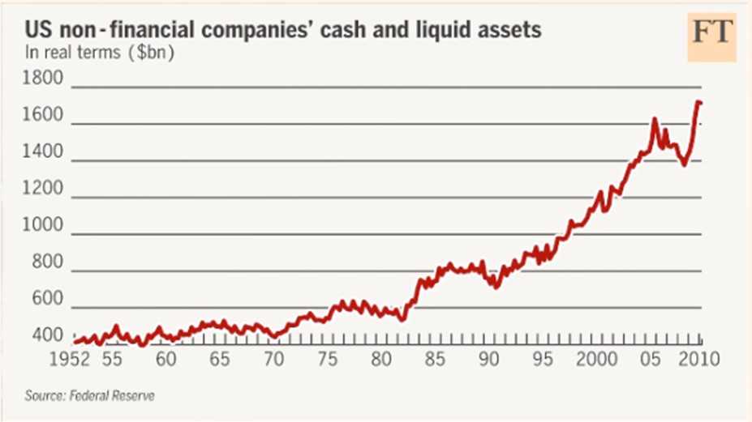
  - 증가추세
- 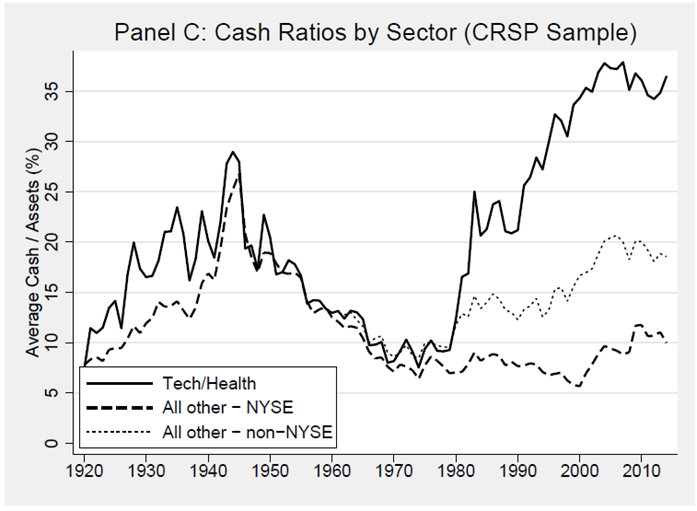
- 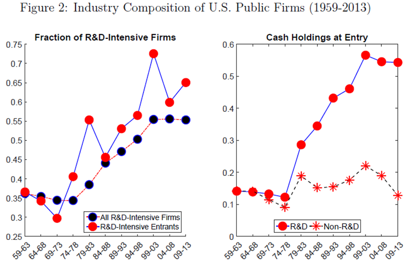
- 

## Common explanations for cash holding
- 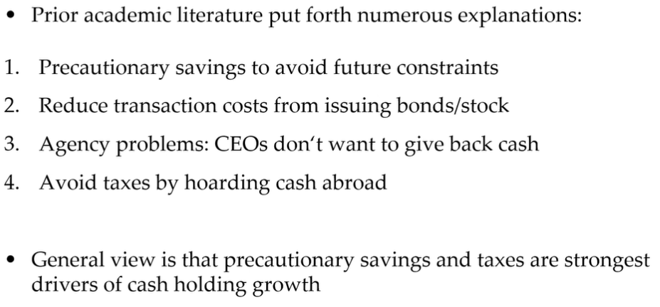

# New Evidence on Cash holding

## Cash rising mostly at innovative firms

- 

## Innovative frims hold more cash at IPO

- 
 
## US-EU gap only among high-R&D firms

- 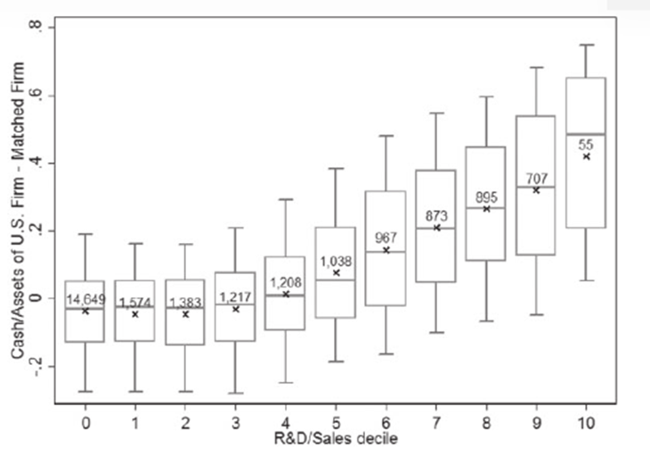

## Summary of recent trends

- Cash holdings/Assets are at record highs, while CapEx spending consistently lower than predicted by Q

- Trends started in 1980s, concentrated among innovative firms
  - Cash holdings have risen mostly at high-R&D firms
  - High-R&D firms hold much more cash at IPO
  - Most US and EU firms hold similar cash levels, except for highest R&D firms 

- Common explanation: Innovative firms are more constrained
  - R&D creates intangible assets, which are poor collateral for raising external financing
    - 교수님은 이거 x apple이 제일 많이 cash 들고 있음

## Can intangibles and human capital explain recent trends? 

- Doettling, Ladika, and Perotti (2019) offer alternative explanation based on how intangible assets created

- Intangibles produced using employees’ knowledge and creativity
  - such “human capital” investment doesn’t require spending much cash up front
  - high R&D firms are not constrained, because they do not require much external financing

- But employees can take intangibles when moving to another firm
  - firms grant deferred pay to retain employees (e.g., stock options)
  - need to hold onto project cashflows until pay vests

# Problems and solutions

## 1. Corporate investment: Theory and Evidence

- *a. Describe two theories of corporate investment that were discussed during the course. State one variable that is central to each theory, and describe its predicted effect.*
  - Answer
    - ## Q theory: 
      - Increase in Tobin's Q leads to increase in investment
      - Q: independent variable, Investment: dependent variable
    
  >> ## Note This hypothesis is only for constrained firms!
    - ## Financial constraints
      - An increase in **cashflows** leads to an increase in **investment**. Or leads to and increase in **cash savings.** ( Anticipate a problem and saves )
        - cashflows >> investment
        - OR
        - cashflows >> cash savings
  
- *b. A researchers estimates the following OLS regression of investment on Tobin’s Q and cashflows, for a large sample of firms and years*

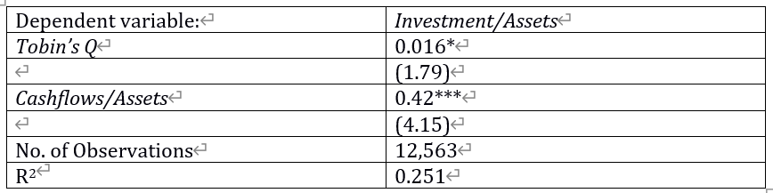

*Interpret each of the coefficients. Which investment theory seems to have more support from these results?*

이거는 t-test 한 것

- Answer
  - 확인해야 할 것!
    1. Direction
    2. Significance

  - Direction
    - **0.016, 0.42 둘 다 positive니까 Tobin's Q and Cashflow/Assest both positively correlated with investment**
  
  - Significance
    - What being siginificant means?
      - more sure that estimates are reliable
    - Check
      - star
        - *** : 1% significant
        - **  : 5% significant
      - t-statistics
        - 2   : generally at 5% level siginificant
        - 2.7 : generally at 1% level siginificant

  >> **주의** 
    **0.42가 0.016보다 크다고 해서 Cashflow 효과가 더 크다고  할 수 없다!!! 비교 불가 ( Apple and orange ) Tobin Q 와 Cashflow/asset은 단위가 서로 다르기 때문이다. 그냥 각각 얼마만큼씩 오르는지만 말하면 된다**
      - Tobin's Q up by one unit > investment increase by 0.016
      - Cashflow/Assets up by one unit > investment increase by 0.42
        - 여기서 Tobin's Q, Cashflow/Assets one unit의 단위가 다르다는 것이다. 
        - They don't have the same unit

- Answer 2
  >> 중요
  - Fianancial constraint theory is better
    - Reason
      - The coefficient is positive as predicted
      - This is higly significant
      - Q theoy expects that Q can explain everything
        - According to Q theory, other variables shouldn't be significant and R^2 should be close to 1.
  
Mesurement error 
  - 얘 때문에 coefficient가 0에 가까워 진다.
  - 또한 mesurement error 가 R^2도 감소 시킬 수 있다.
  - mesurement error is not the only problem here
    - **Where mesurement error come?**
      - Calculation of depreciation at accounting is very rough.
        - This makes estimation of market value incorrect 
      - numberator should include market value of debt but book value of debt is often used

*c. Describe one econometric issue that could affect the above results. Explain how this issue could explain the discrepancy between theory and the above results.*

## 2. Motivation for precautionary savings

- *a. Explain why it may be optimal for some firms to pass up investment opportunities today, and instead save cash to invest in future years.*

  - Every company knows that 'future is unpredictable'. So do the precautionary savings
  - However not all firms face this problem
    - Firms that can borrow their funds at donwturn are not financially constrained.(Through bank or issuing bonds) So they would not engaged in precautionary savings
  - **그래서 prcautionary saving을 위해서는 '두' 가지 조건이 충족이 되어야 한다.**
    1. Future is unpredictable
    2. Hard to get external financing

- *b. Consider a company that currently has cash holdings of 200, and has access to two investment projects. Both projects require upfront investment of 100, and both return 120 in the same year.* 

- *Next year, with certainty the company will have access to two new projects that are identical to the ones described above. With probability of 0.6 the firm’s cashflows next year will be 100, and with probability 0.4 they will be 0. The discount rate is 0.1. Cash earns a risk-free return of 0.*

- *This year, should the firm save 100 of the cash for precautionary reasons, or invest 200 in both projects?* 
  - Answer

    - ## Invest in both projects in this year

      -2x100  +2x120/(1+0.1) + **0.6x(100/1.1-100/1.1+120/(1+0.1)^2)  + 0.4x0**
        - the number of projects x upfront investment cost + the number of projects x return of projects/(1+ discount rate) + the probability of project 1 x ( cashflow/(1+discount rate) - upfront investment cost/(1+discount rate)  return of projects/(1+ discount rate)^2) + the probability of project 2 * 0

    - ## Precausautionary savings

      -2x100  +120/(1+0.1) + **0.6x(200/1.1-200/1.1+2x120/(1+0.1)^2) + 0.4x(100/1.1-100/1.1+120/(1+0.1)^2)**
        - Good case 에서는 돈이 생겨서 어차피 투자할 돈이 있다. 그래서 무조건 투자하는거
        - Bad case에서는 투자할 돈이 없다.
          - Saving이 있어야만 투자할 수 있다.

    - ## Trade-off Giveup second-best project today to save cash and ensure you can invest in best project next year

## 3. Determinants of corporate cash holdings

- *a. State three variables that prior empirical work has found to be associated with corporate cash holdings. Choose one of these variables, and carefully explain why theory predicts that it should affect cash holdings.*
  - Answer
    - Precautionary savings/financial constraints
      - Firms that are financially constrained are more likely to do cash savings
    - Taxes
      - When US taxes were too high, many firms hold cash in foreign countries. They waited until US governments eases the tax laws
    - Agency problems
      - 그냥 자기 이익 때문에 cash 저축 안하고 투자 막 하는 것
    - Retention of knowledge workers
      - Showing good financial positions  to the workers. So that companies can hire good workers

- *b. Explain why firms with large amounts of intangible assets may be financially constrained.*
  - Answer
    - Intangible assets such as brand.
    - A lot of coporate value comes from intangible values. Because these are not fixed, 
    - collateral (담보로 연계되는 거)
      - coporate loan: collateral: 회사 지분, 등등

    - Intangible assest is not coolateral (연계되지 않는다는 말)

    - A lot of Intangile assest (ex, software) does not promise collateral >>  Not promise collateral means hard to get a loan
      - Why software cannot be a collateral.
        - it takes years to finish products, and this cannot be sold when developing is in progress

- *c. Suppose firms hold cash only to avoid becoming financially constrained in the future. What does the below figure imply about how financial constraints have evolved over time?*

  - Answer
    - The only reason to hold cash is precautionary savings
    - 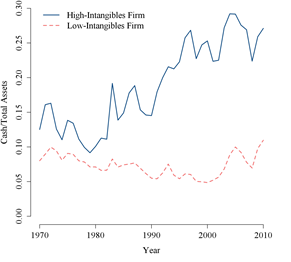
      - Interpretation
        - High intangible Firms hold more cashflow
        - They are more constrained overtime
          - Increase in cash holding in blue line may mean the increase in financial constraints
      - There are probably many reason why cash holdings increase
 

