# OLS & Experience

## Part A

- Causal inference
  - 종속 변수를 바꾸면 독립 변수가 **어떻게 변할 까**?
  - 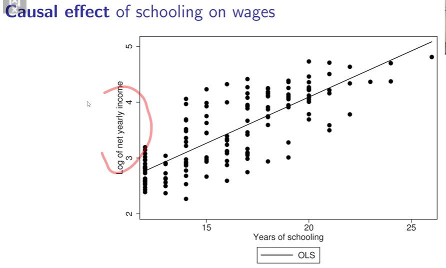!
    - 내가 학교를 15년 다니는 것에서 16년 다니면 income이 얼마 오른다.
    - 여기서 관건은 이 연관 관계가 진짜인지 단순히 같이 나타나는 현상인지 알아내야 한다.

- Prediction
  - 종속 변수 Y를 **예측** 하는 것
  - 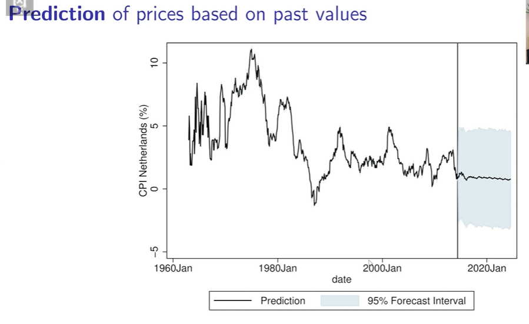
    - 형광펜 부분을 예측

## Part B

- OLS: Drawing a line through data(CH4, p146-159)
  - 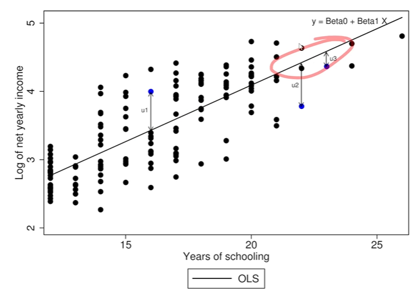
  - 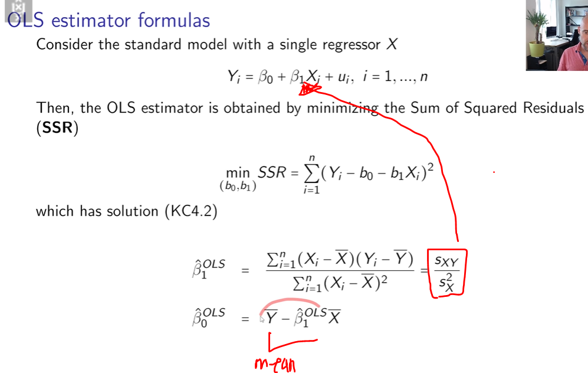
  - 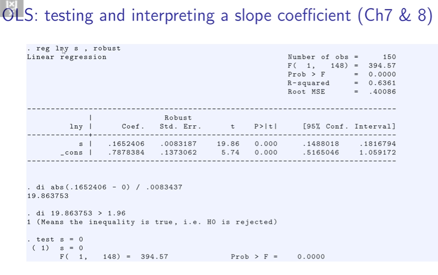
  - 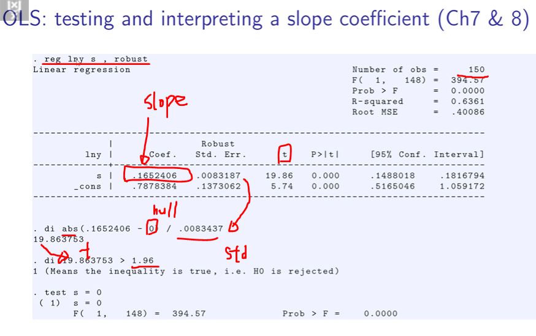

  -Core assumptions
    - 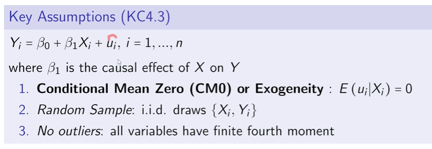
    - 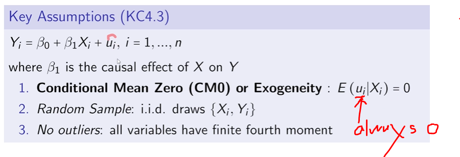
    - Consistency
      - 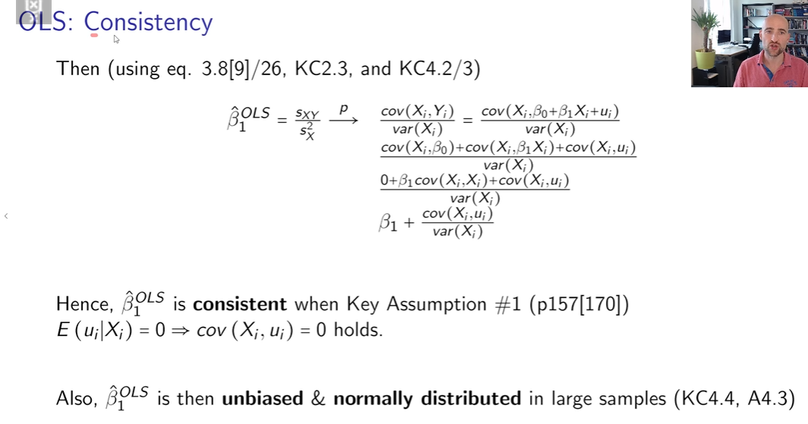
      - 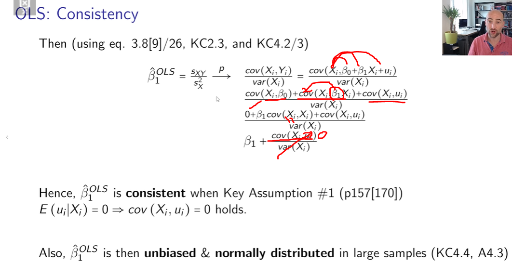
  - Endogeneity
    - Endogeneity leads to OLS inconsistency
      - 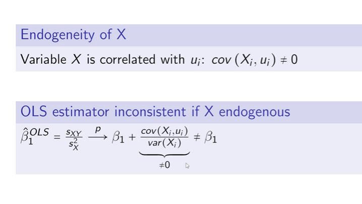
      - 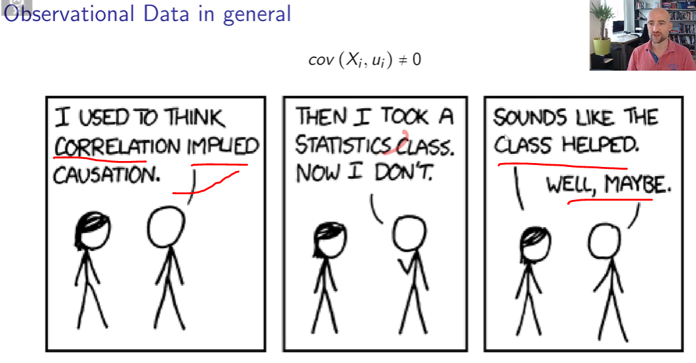 
    - Sources of endogeneity
      - ??
      - 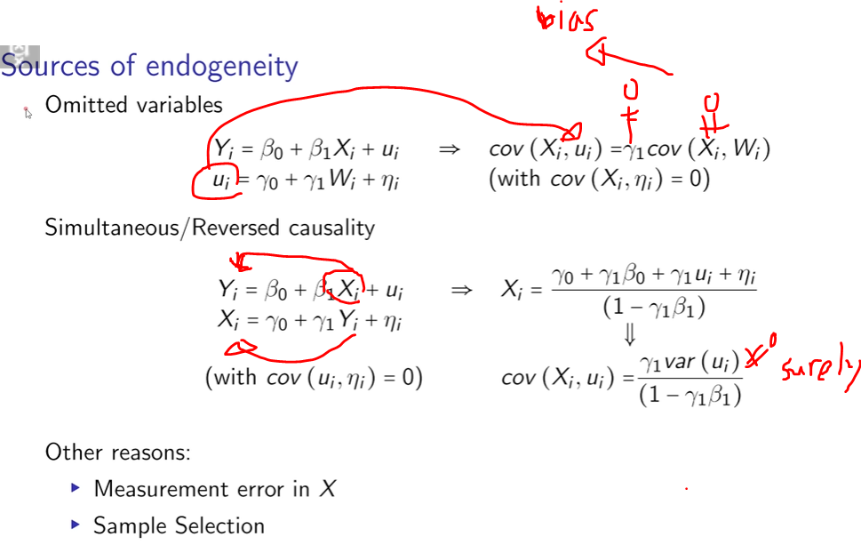
      - 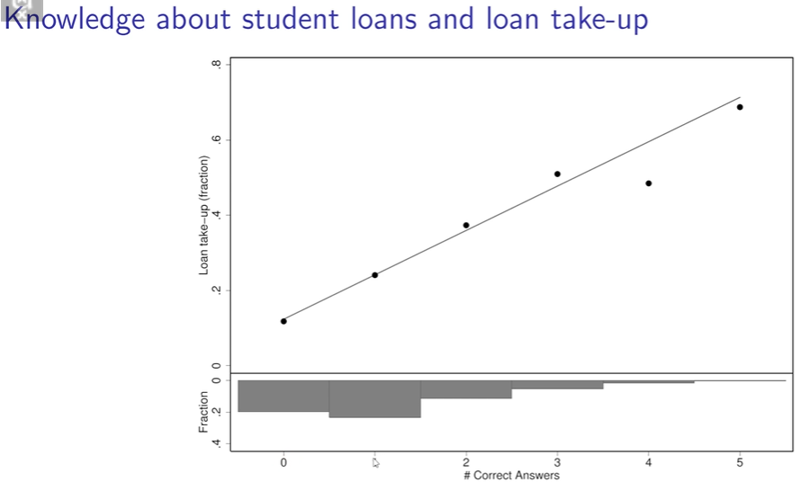

  - Does knowledge increae loan take-up? or Does loan takeup increase knowledge?
    - 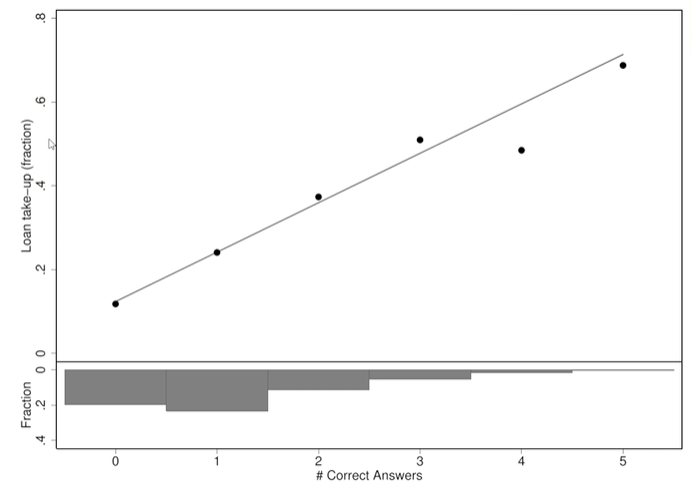
    - 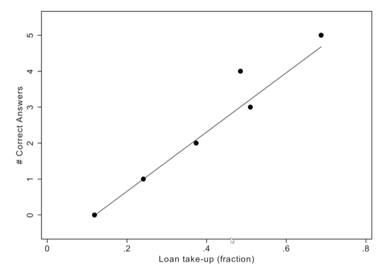
    - **Statistical association does not imply causation!**