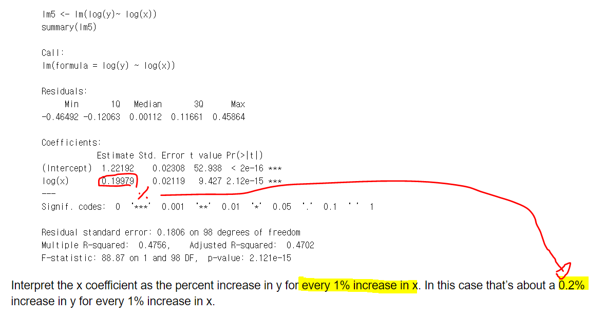
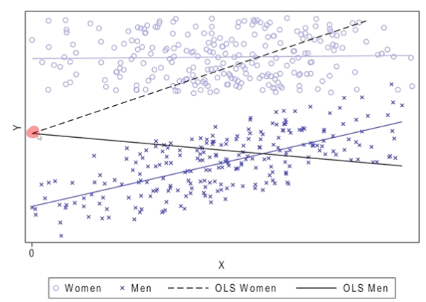

# OLS & Experience

# Part A

- ## Causal inference
  - 종속 변수를 바꾸면 독립 변수가 **어떻게 변할까**?
  - !
    - 내가 학교를 15년 다니는 것에서 16년 다니면 income이 얼마 오른다.
    - 여기서 관건은 이 연관 관계가 진짜인지 단순히 같이 나타나는 현상인지 알아내야 한다.

- ## Prediction
  - 종속 변수 Y를 **예측** 하는 것
  - 
    - 형광펜 부분을 예측

# Part B (OLS & Endogeneity)

- ## 목차
  - ## Estimation and interpretation
  - ## Endogenetiy and inconsistency
  - ## Source of endogenetiy

- OLS: Drawing a line through data(CH4, p146-159)
  - 
  - 
    - Sum of Squared Residuals가 최소가 되는 직선
  - 
  
  -Core assumptions
    - 
    - log regression 해석
      - %로 해석!
        - 
    - Consistency
      - 
  - Endogeneity
    - Endogeneity leads to OLS inconsistency
      - 
      -  
    - Sources of endogeneity
  
      - 
      - 
  
  - Does knowledge increae loan take-up? or Does loan takeup increase knowledge?
    - 
    - 
    - **Statistical association does not imply causation!**

# Part C: Potential outcome
- **Causal effects**
  - ex)
    - Effect of Education on earnings
    - Effect of Performance pay on firm profits
    - Effect of FDI on economics growth
    - Effect of finanical regulation on finanical stability
  - Typically the average imapct of a one unit 'exogenous' change in '**treatment**' X_i on outcome variable of interst Y_i

  - Knowldege of causal effects important for economic policy & business decisions
- **Potential outcome**
  - 
    - ATE: Treatment 의 효과. 하지만 알기는 어렵다.
- Potntial outcomes **example**: loan take-up and knowledge
  - 
- The counterfactual problem 
  - What would happen in the other world
  - 
  - 
    - Here is no causal effect
  - 
  - 
- The counterfactual problem: Solve by OLS?
  - 
    - B1 = Y_i(1) -Y_i(0) 인데 둘 다 한번에 알 수가 없기 때문에 값 자체를 알 수 가 없어서 잘못된 가정이 아닌가?
    - B_0 = E(Y_i(0))
      - 추정이 된 control 집단의 값
        - 왜 추정이 된거를 사용?
          - 이것은 추정이 안 된 값을 알 수가 있어서 사용하지 않아도 되는 것 아닌가?
- The counterfactual problem and endogeneity
  - 
- Identifiaction: Solutions to the counterfactual problem
  - 
  - Identification 2가지 방법
    - 

# Part D 
## Experiments - Design
## How to set up experiments

- Experiments in the social sciences
  - 
    - Spill overs
      - Failure of Internal validity
      - Treatment 집단이 control 집단에 영향을 미치는 것
    - General equilibrium effects(일반화 오류 같은거 같다.)
      - Failure of External validity
      - This become noticeable only if the program is scaled to a broader population or extended to a longer term. This is for example the case when prices or norms change as the program reaches a broader population. 
>> ## Identification using **experimental** data 
  - .png)
  - Unconditional Random assignment
    - 
      - Justify 방법
        - Treatment (X) 가 있던 없던 간에 Y0 - E(Y0) 의 기댓값은 0이다.
          -   Y0 - E(Y0)  원래 control 집단의 값과 추정된 control  집단의 값들의 차이
  - **Conditional Random assignment**
    - 
      - Control variable만 고려했을 때 Y(0) - E(Y(0)) 의 기댓값이 Control variable과 Treatment를 같이 고려했을 때  Y(0) - E(Y(0)) 의 기댓값과 같다.
  - **Testing random assignment**
    - 
    - Why random assignment can not be proved?
      - picture
      - Potential W here are infinite
    - Tablue mean comparison
      - Experimental design
        - 개별적으로 t-test를 한 것
        - 
        - 
      - **Convincing others of random assignment**
        - 
        - Covariance balance test
          - 그냥 전체 변수가 0인지를 F-test로 확인 하는 것
          - 

# Part E
## Experiments - Analysis

## Analysis by simple regression

- 

## Good Control

- 
- Case #1
  - Conditional Assignment: Only CMI holds

- Conditional Mean Independence
  - 
  - 
  - 
  - 
- 
## Good Control Case #2
  - 

## Good Control Case #3
  -
  -
    - B_3 Male 을 빼먹었을 때 
## Bad Control
  - 
    - 교육 효과에 직업을 변수로 넣으면 교육이 endougenous 된다.

 # Part F

 ## Validity
 - 
 - Where validity fails
   - Internal validity fails
     - 
       - 집단이 선택하는게 또 치우침
     - Attrition: dropping out
       - 
         - Sample 들이 빠져 나가는 것
     - Experimental effects
       - 
       - 실험 받고 있다는 사실 때문에 대상자들이 바꾸는 것
     - Spillovers
       - 
       - 감염률이 줄어 드는 것
         - 전염성을 두 집단 모두 줄여서 생기는 것
     - Wrong standard errors (s.e)
       - 
       - 이분산성은 모델이
     - Fraud
       - prof Stapel from Tilburg Uni
   - External validity
     - !
       - General equilibrium effects???
       - Black Box???
 - Difference between partial comliance and substitution (F3) using Q 13.5b example?
   -      
# f
## Summary

- 

