# Topic 1
근대 회사에 있어서 회사의 운영

Coporate governance는 투자자들이 어떻게 회사가 돈을 쓰는 것을 통제하는 것을 도와주는 것.

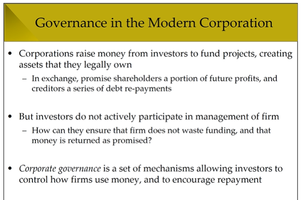

## Governance Problems in Corporations 
( 회사 운영방식에 있어서 생기는 문제들 )

   - Agency problem
     - Investors vs managers of firms
     - Principal : firm's owner (shareholders), 주주
     - Agent     : **hired** to manage firm on day-to-day bisis, CEO 같은 경영진
        - This can lead to moral hazard 
        - 
        - 

# Topic 2: Principal-Agent Problem
  - Basic Setup
    - 
      - This setting 다른 종류의 비즈니스 형태에는 적용 안됨
  - Key Assumptions
    - 매니저와 투자자는 이해관계 다르다.
    - 서로 아는 정보 다름
    - 투자자가 직접 판단하려면 돈이 많이 든다.
    - 미래 소득은 불안정해서 확률에 의존
      - 
  - Why Managers Pursue Private Benefits
    - Why a conflict of interest between managers and investors?
    - 옛날 모델에서는 투자자는 risk와 return 만을 생각 함
    - Agency model은 사람 행동에 대해서 완전한 견해를 가짐
      - 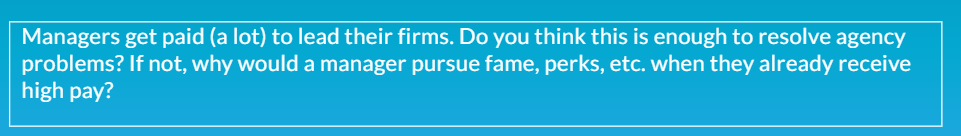
  - Common Examples of Private Benefits
    - Self-dealing or outright theft of funds
    - Corporate empire 손해보는 대도 회사 규모 키우는거
    - Corporate perks 회사돈 막 쓰는거
    - 열심히 일 안함
    -  
    -  
       -  회사돈 막 쓰고 망한 사례
    -  
       -  요점은 이게 회사돈을 낭비하는 건지 회사 발전을 위한건지 알기가 힘들다
       -  Pirv
       -  
          -  Hard to tell
# Topic 3: Principal-Agent Problem Examples

-Example 1: Investment and Agency
 - 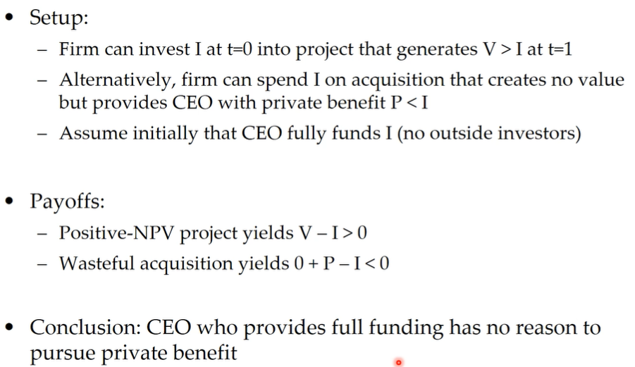
 - Setup
   - 첫 번째 옵션
     - 1.투자는 Value > Investment 일 때 회사가 project에 투자.
   - 두 번째 옵션
     - CEO 에게 Pivate benefit P를 제공한다. (P < Investment )
   - ## 여기서 가정은 Investment는 CEO가 다 낸다는 것이다. 외부 투자 XX 
 - 결과 수학적으로 표현, Payoff
   - 1. V- I > 0
     - CEO가 투자자금을 회사의 이익을 창출하는 프로젝트를 만듬
   - 2. P -I < 0
     - CEO가 투자한 돈을 Private benefit으로 전환
 - Conclusion
   - ## CEO가 자기 돈으로 회사 차리면 private benefit을 추구할 이유가 없다.
- Example 2
  - CEO가 부분 투자를 하는 경우
    - 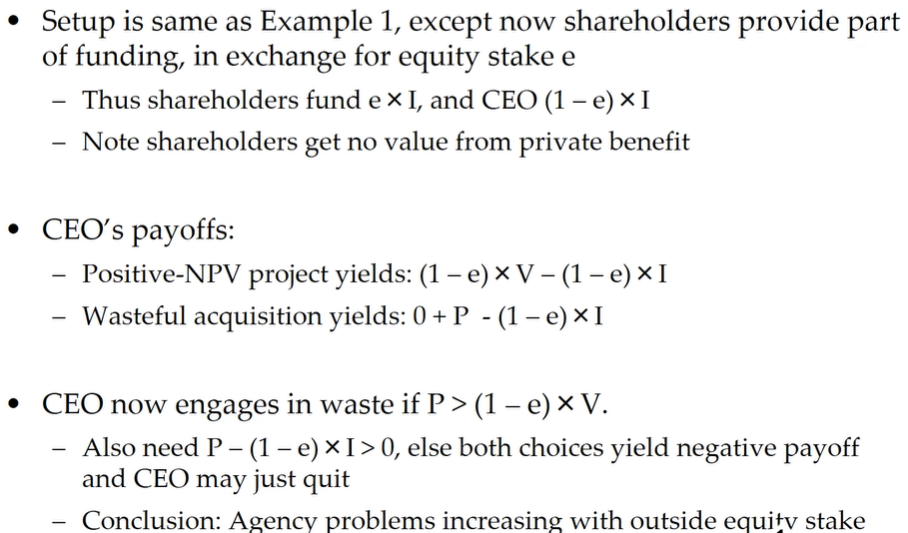
    - 
    - 
- Why CEOs May Choose Waste
  - 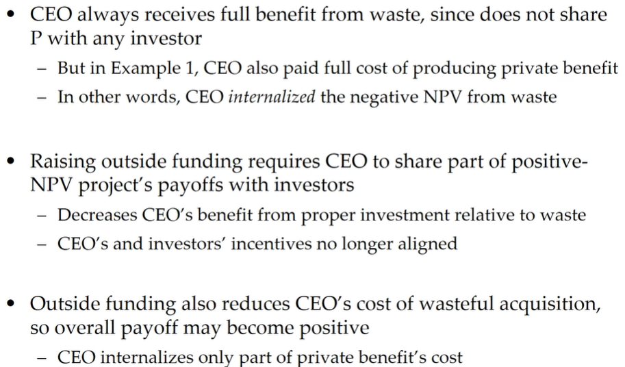
  - 
    - Answer: Increase owner stacks

# Topic 4 : Trying Pay to Performance

## 

- Moral Hazard and Sking in the Game
  - 
    - CEO가 회사 지분에 많이 연관 되게 함
- Threat of Firing as Incentive
  - 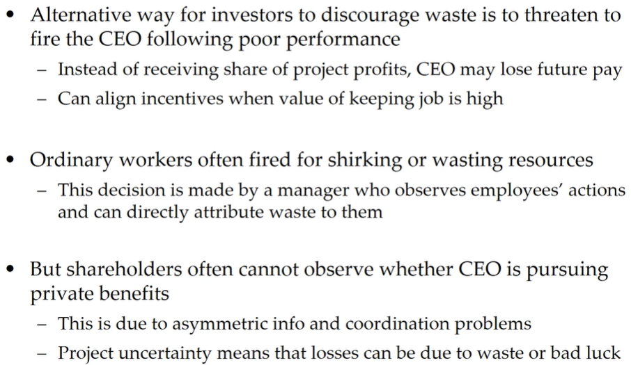
  - 해고 한다고 위협해서 막음
- Ex 3: Private Benefits and CEO Wealth
  - 
  - 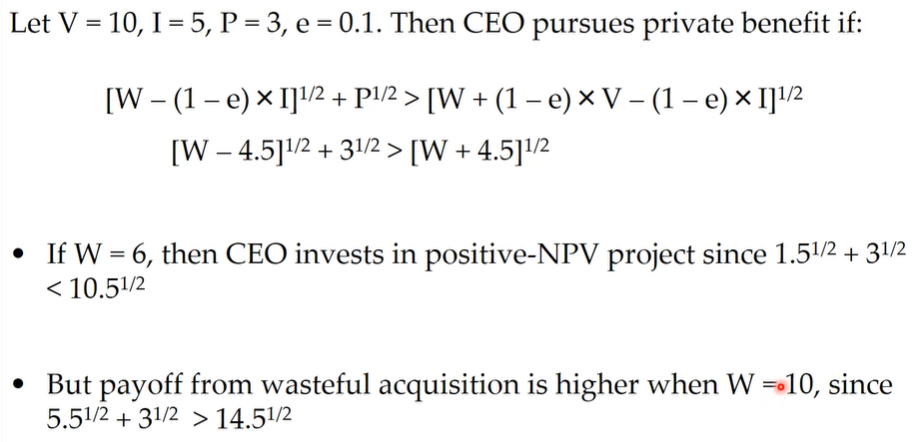
  - 
- Equity Incentives and CEO Wealth
  - 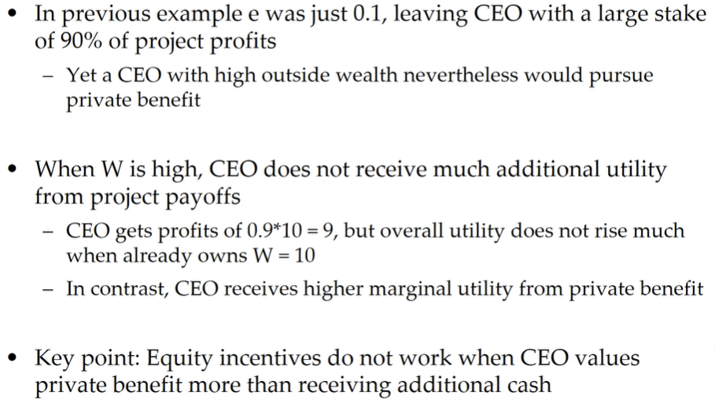
  - 

# Topic 5: Uncertainty and Moral Hazard

- Moral Hazard with Uncertain Cashflows
  - 
- Model Setup
  - 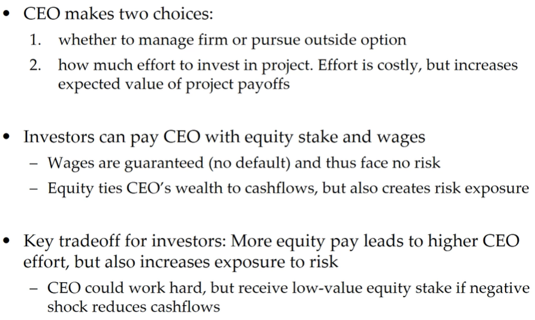
  - 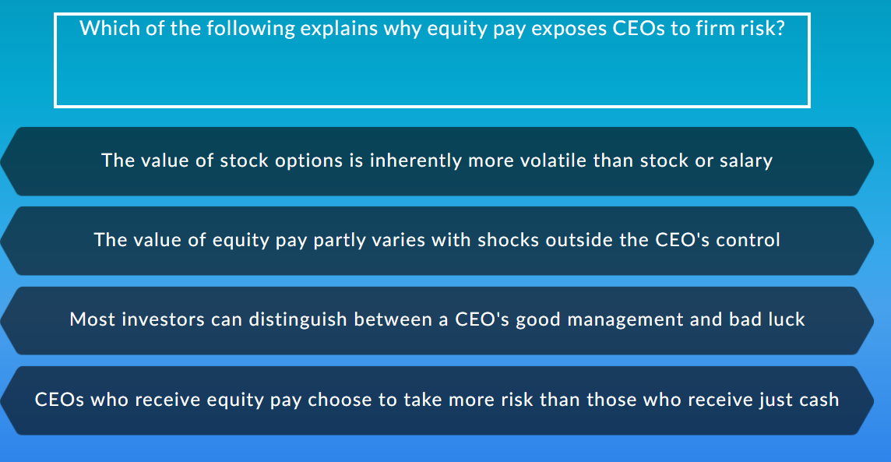
- Solvng Model with Uncertain Cashflows
  - 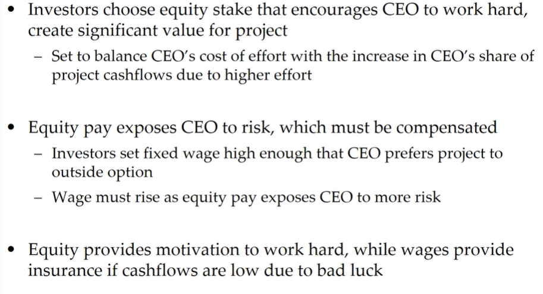
  - 
- Summary of Governance using Equity Pay
  - 
   - Agency problem은 tying pay to performance로 줄일 수 있다.
      - Tying pay to performance
        - CEO가 개인의 이익을 추구하는 비용이 자기의 이익과 관련 되게 함
        - Equity pay (주식으로 임금 지불)가 CEO에게 더 큰 위험을 가져다 주면 Wage가 올라야 한다.
    - Equity는 열심히 일할 동기부여을 한다. Wage는 Cashflow가 불운으로 인해서 좋지 않을 때 보험을 제공
  - 

# Topic 6: Debt's Role in Governance

- What role does Debt Play in Governance?
- Debt가 회사 운영에 있어서 하는 역활
  - 
    - 일단 CEO가 debt를 통해 private benefit을 추구 하려면 심사를 통과해야 하는데 이는 fixed hurdle이라고 한다.
    - CEO가 debt를 못갚으면 CEO는 자리를 내놓아야 한다. 
      - 그런데 갚기만 하면 2개의 장점이 있다.
        - 빌려준 사람이 CEO의 소득에 영향을 미치지 않음
        - 그리고 Debt는 CEO가 private benefit을 추구하는 것의 대가를 줄인다.
    - debt의 핵심 기능: CEO가 충분한 현금을 보유하게 함
      - 하지만 이게 risk-shifting 같이 위험회피하게 할 수 있음
- Example 4: Mitigating Role of Debt
  - 
  - 
  - 
- Summary of Governance using Debt
  - ![](2021-09-16-09-21-45.png
    - There is no perfect solution without trade off
  - 

# Topic 7: Other Governance Mechanism

- 강력한 법적 시스템이 도둑질과 투자자의 권리 보호
  - 하지만 empire building 과 bad investment같은 거는 불법으로 할 수가 없어서 못막음 

- 회사 boards of director들은 주주들을 위해서 CEO를 봐준다.
  - CEO를 해고할 수가 있고, 투요한 투자들을 승인한다.
- 대주주들은 주식을 사서 CEO가 행동을 바꾸도록 할 수가 있다.
- CEO가 이상하게 경영하면 다른 회사들이 인수할 위험이 생기는데 이는 CEO의 행동이 올바르게 할 수 있다.

- Strong legal system prevents theft and protect investors’ rights 
  - But cannot outlaw empire building, bad investments

- Corporate boards of directors can monitor CEO on behalf of dispersed shareholders
  - Have power to fire CEO, set pay, approve major i-nvestments

- Large activist investors can buy block of shares and try to force CEO to change behavior

- Takeover market can discipline bad managers
  - If firm is wasting money, competitor may acquire it and fire CEO

- 

## Brief Introduction to Boards, Board에 대한 간단한 설명

- Board는 12명의 Director로 구성이 되고 주주들을 대신해서 CEO를 감시한다.
  - 주주들이 선출하는데 1-3년의 임기가 있다.
  - 일년에 몇번 미팅을 하는데 이때 전략, 투자 결정, 등을 한다.
- Board가 필요한 이유는 주주들이 시간, 전문성 그리고 CEO를 감시할 여건이 부족하기 때문이다.
  - 근데 director가 CEO랑 친하면 중요한 결정은 피한다.
- **Board는 주주들을 위해서 결정을 한다. debtholders, employess, society 아님!**

- Board is group of 12 directors that (in theory) monitors CEO on behalf of shareholders
  - Elected by shareholders every 1-3 years
  - Hold several meeting per year to discuss strategy, vote on key decisions, oversee financials, design executive compensation

- Boards necessary because dispersed shareholders lack time, expertise, and coordination to monitor CEO
  - But directors may avoid tough decisions if they are close to CEO or see their role as merely providing friendly advice

- Boards have legal fiduciary duty to make decisions in best interests of shareholders (not debtholders, employees, or society)

- 

- Example: Board of Goldman Sachs
  - 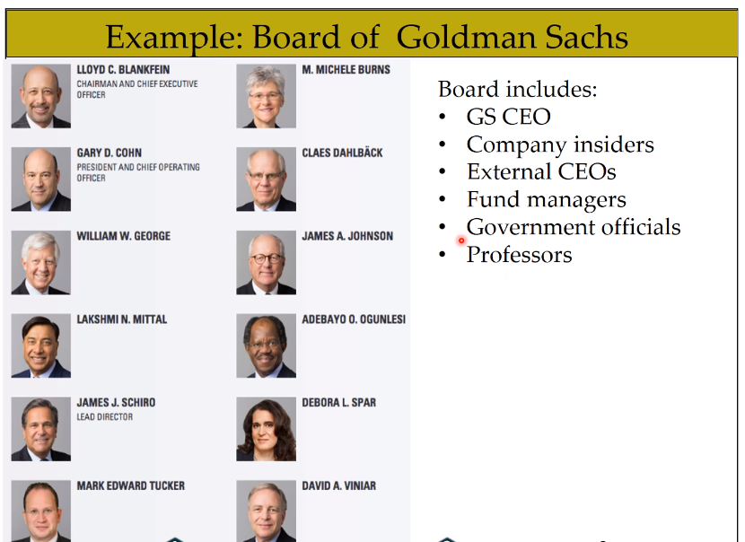
  - 

## Governance and Corporate Investment

- 토빈의  Q는 다른 시장 참여자 대비 회사가 소유하는 Capital의 가치를 측정한다.
  - 회사 운영이 별로면 capital은 CEO에 의해서 안좋아 질 것이다.
  - 이것을 정리하면 Tobin's Q는 회사 운영의 질을 나타낸다.
    - Tobin's Q has positive correlation with quality of governance

- 초기 예시에서 외부의 equity 투자가 매니저가 개인의 이익을 추구하게 한다고 나왔다.
  - 그런데 특정 회사들은 높은 high equity funding을 필요로 한다.

  - 이유
    - 혁신적인 회사들은 대출 (debt)을 받기가 어렵다. 그래서 outside equity에 의존한다.
      - 여기서 투자자들은 아직 상품화 되지 않은 것의 가치를 매기는데 어려움을 느낌

- Recall, Tobin’s Q measures value of capital in firm’s possession relative to other market participants
  - When governance is poor, capital may be destroyed by CEO
  - Implication: Q is increasing in firm’s quality of governance

- Earlier examples showed that large outside equity stake increases manager’s incentive to pursue private benefit
  - But certain firms may require high equity funding to invest in projects

- Innovative firms may face trouble raising debt, thus rely on outside equity (e.g., venture capital)
  - Investors have trouble verifying quality of investment into intangibles
  - Implication: Innovative firms more prone to agen

# Topic 8: Research on Governance

## Academic Research: Measuring Governance

- Governance is a very broad, abstract topic
  - Encompasses many institutional features of corporations and markets
  - In short, very difficult to measure precisely

- Common measures:
  - GIM Index of 24 governance provisions (Gompers, Ishii, Metrick 2003)
  - E Index extracts 6 most crucial provisions from GIM (Bebchuk, Cohen, Ferell 2009)
  - Percentage of independent directors on board
    - Also board size, pct. busy directors, director tenure
  - Indicator for whether CEO is also board chairman
  - CEO pay-performance sensitivity (incl. turnover)

- Early studies regressed Tobin’s Q or firm value on governance
  - Ex.: GIM index validated by showing that firms with high values have lower long-run stock returns

- Problem: Market values should already price in firm’s existing governance structures 
  - To identify value impact, need to examine changes in governance
  - Yet very few governance features change exogenously

- Some researchers argue that existing governance structures have evolved because they work (Hermalin and Weisbach 1988)
  - If governance ineffective, why hasn’t market forced a different equilibrium outcome?

## Widely Studied Research Questions

- Academic research into governance problems has been very active for several decades
  - Some research questions are considered to be settled, others have been set aside due to identification problems
  - Governance researchers have strong (and often divergent) opinions

- Widely studied topics include:
  - Effect of governance on firm value
  - Do boards tie CEO pay or turnover to firm performance
  - Do CEOs respond to monetary incentives
  - How does debt affect governance
  - What do activist investors do, and what factors affect their success
  - Do family or private firms make better decisions than public ones
  - Do CEOs profit from insider trading

## Open Research Areas

- Existing studies have mainly focused on S&P 1500 firms for which data is widely available 
  - These are large firms with stable business models. Yet research tends to take a “one size fits all” view on governance

- Promising topics include studying how governance works at young or innovative firms
  - What is best way to convey incentives to founder CEOs?
  - How does governance vary over a firm’s life cycle?
  - Are agency problems more severe at high-intangible firms? 

- Another interesting question: Has pay benchmarking made CEO compensation too complex?

## Recent Governance Research at UvA

- Ladika, Jochem, & Sautner (2018); Ladika & Sautner (2020) examine CEO’s incentives from equity vesting periods
  - CEOs can only exercise options (or keep them when departing) after an initial vesting period expires
  - Studies show that exogenous decrease in vesting periods led to higher voluntary turnover, more short-termism to pump up stock price

- Denis, Jochem, and Rajamani (2019): When shareholders vote against excessive CEO pay, competitor firms also reduce CEO pay 

- Vladimirov (2019) develops theory of length of CEO contracts and amount of severance received upon firing
