# Topic 1

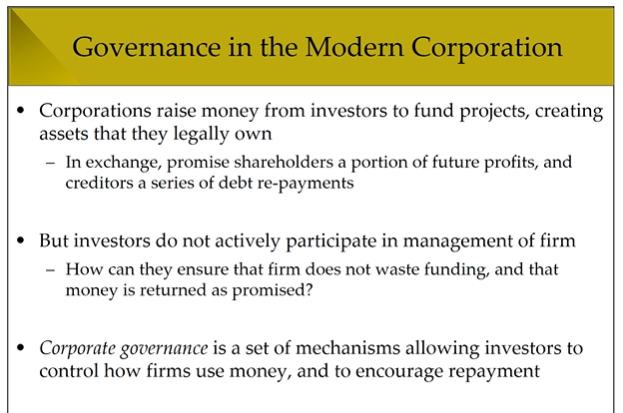

## Governance Problems in Corporations
   - Agency problem
     - Investors vs managers of firms
     - Principal : firm's owner (shareholders)
     - Agent     : **hired** to manage firm on day-to-day bisis
    - This can lead to moral hazard 
    - 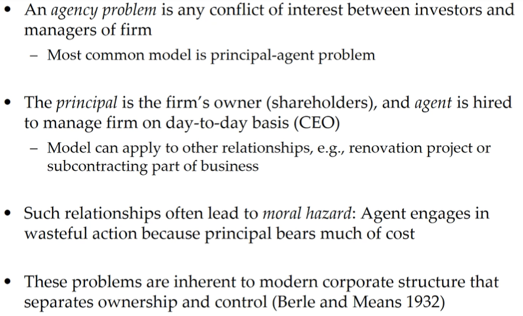
    - 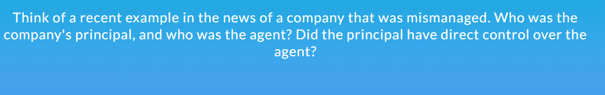

# Topic 2: Principal-Agent Problem
  - Basic Setup
    - 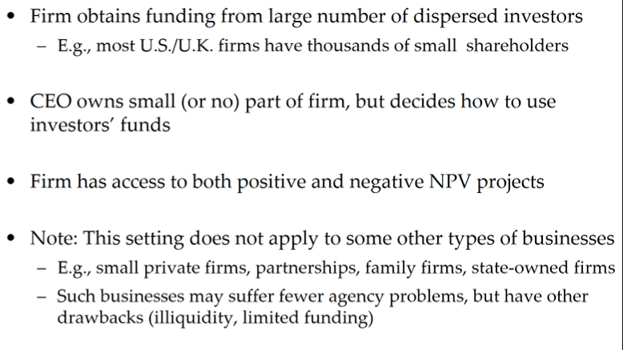
    - This setting 다른 종류의 비즈니스 형태에는 적용 안됨
  - Key Assumptions
    - 매니저와 투자자는 이해관계 다르다.
    - 서로 아는 정보 다름
    - 투자자가 직접 판단하려면 돈이 많이 든다.
    - 미래 소득은 불안정해서 확률에 의존
      - 
  - Why Managers Pursue Private Benefits
    - Why a conflict of interest between managers and investors?
    - 옛날 모델에서는 투자자는 risk와 return 만을 생각 함
    - Agency model은 사람 행동에 대해서 완전한 견해를 가짐
      - 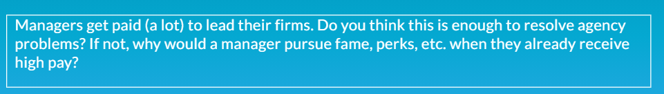
  - Common Examples of Private Benefits
    - Self-dealing or outright theft of funds
    - Corporate empire 손해보는 대도 회사 규모 키우는거
    - Corporate perks 회사돈 막 쓰는거
    - 열심히 일 안함
    -  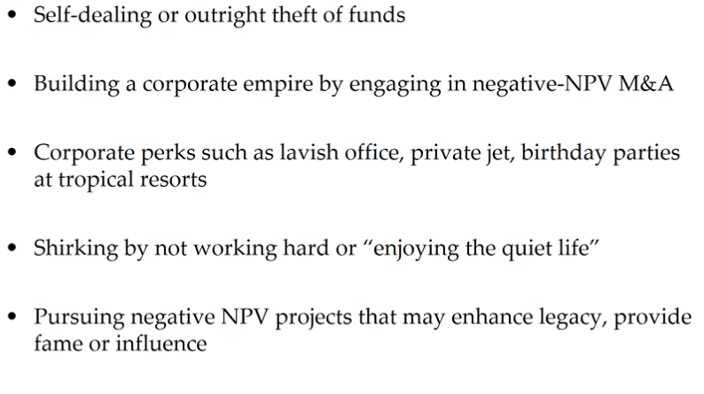
    -  
       -  회사돈 막 쓰고 망한 사례
    -  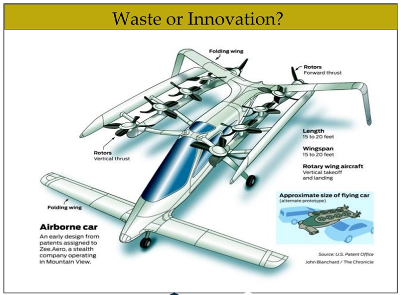
       -  요점은 이게 회사돈을 낭비하는 건지 회사 발전을 위한건지 알기가 힘들다
       -  Pirv
       -  
          -  Hard to tell
# Topic 3: Principal-Agent Problem Examples

-Example 1: Investment and Agency
 - 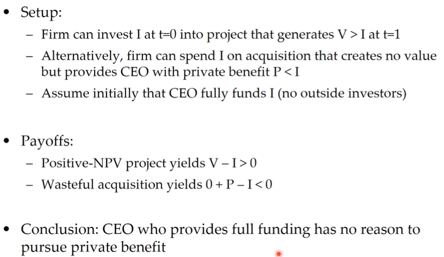
 - Setup:
 - Conclusion
   - CEO가 자기 돈으로 회사 차리면 private benefit을 추구할 이유가 없다.
- Example 2
  - CEO가 부분 투자를 하는 경우
    - 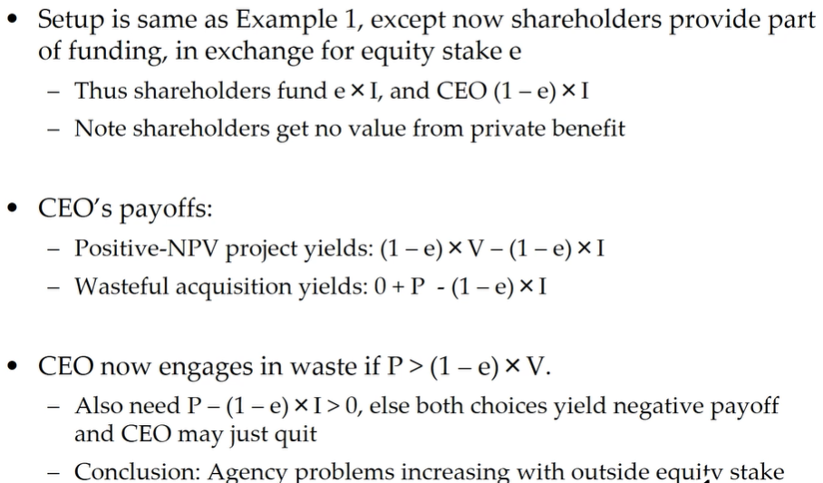
    - 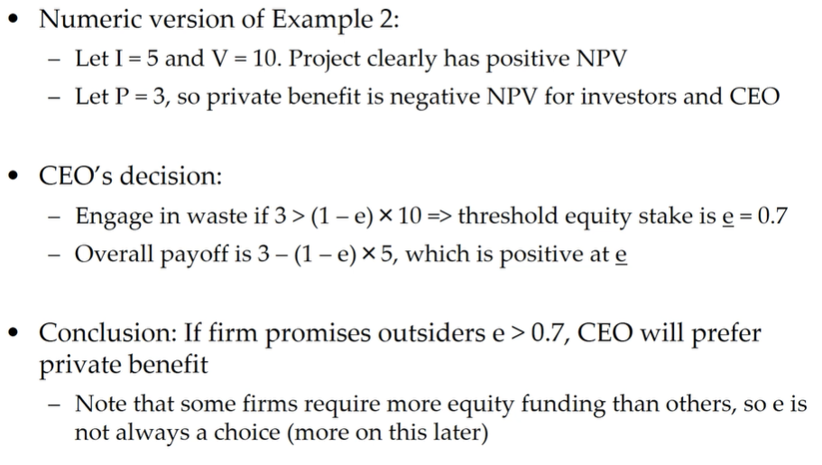
    - 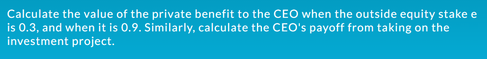
- Why CEOs May Choose Waste
  - 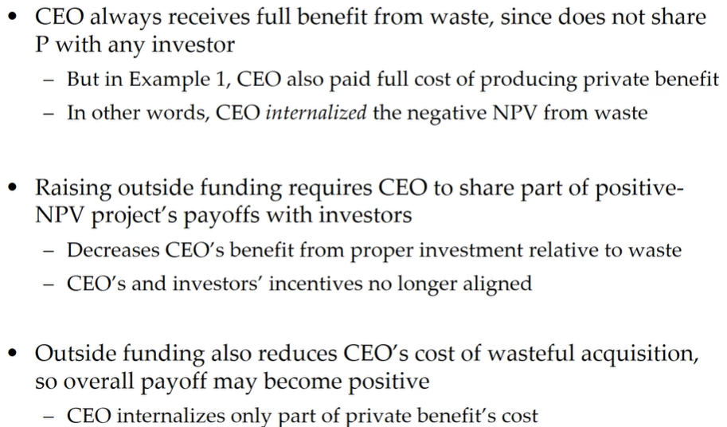
  - 
    - Answer: Increase owner stacks

# Topic 4 : Trying Pay to Performance

## 

- Moral Hazard and Sking in the Game
  - 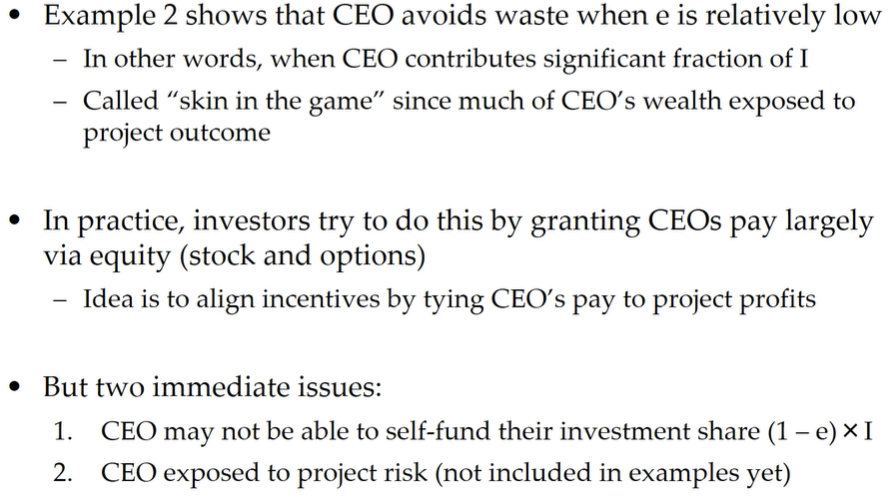
    - CEO가 회사 지분에 많이 연관 되게 함
- Threat of Firing as Incentive
  - 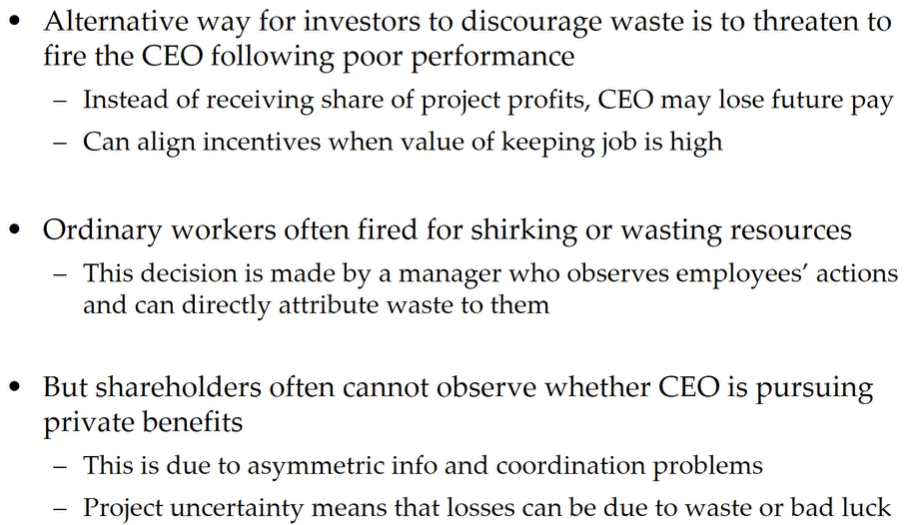
  - 해고 한다고 위협해서 막음
- Ex 3: Private Benefits and CEO Wealth
  - 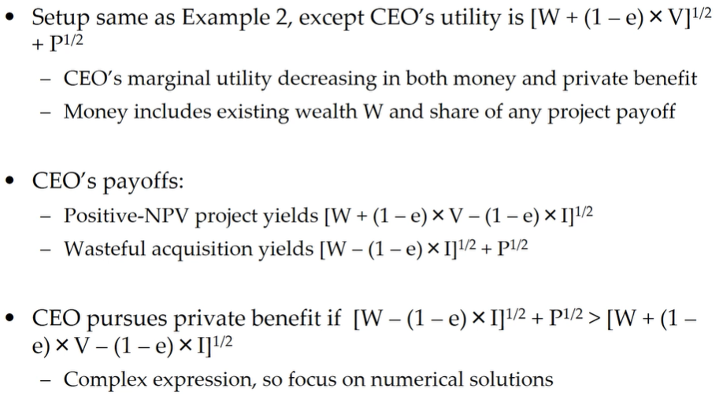
  - 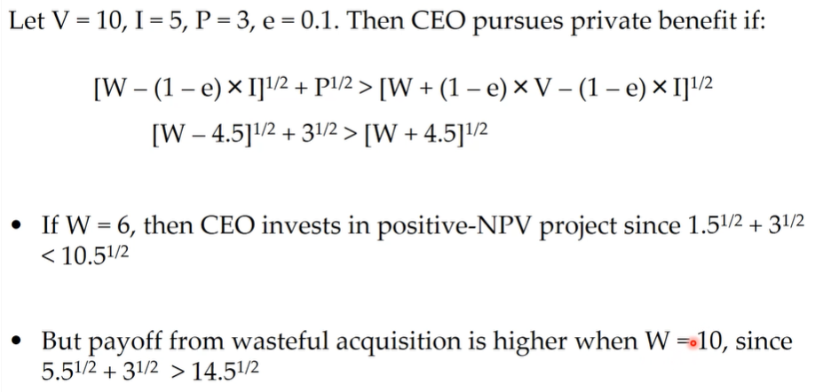
  - 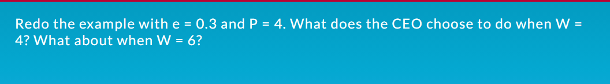
- Equity Incentives and CEO Wealth
  - 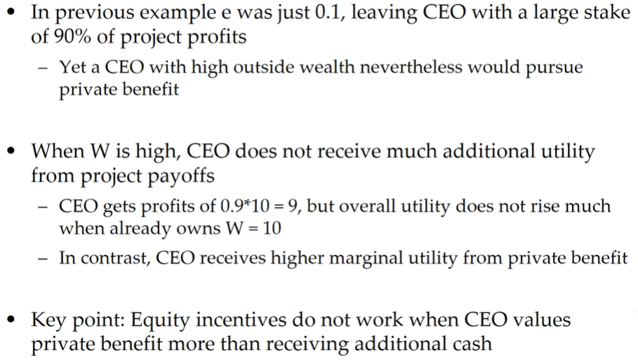
  - 

# Topic 5: Uncertainty and Moral Hazard

- Moral Hazard with Uncertain Cashflows
  - 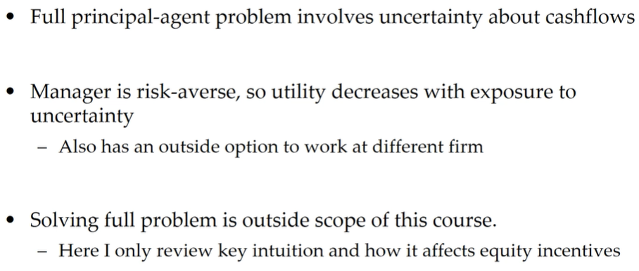
- Model Setup
  - 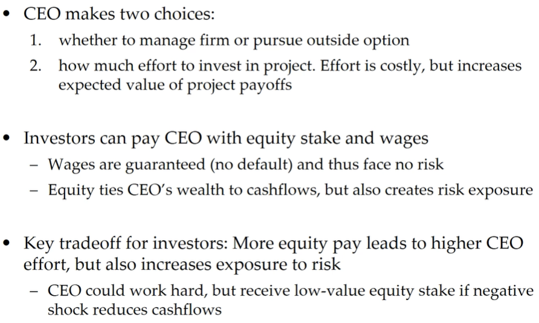
  - 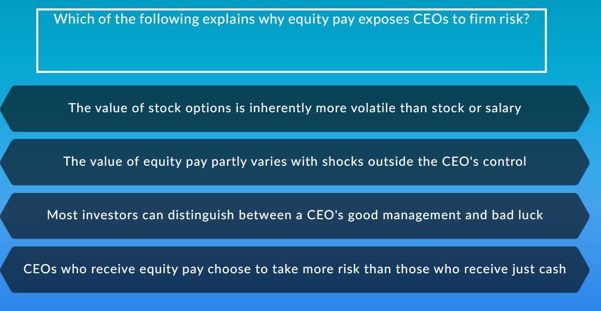
- Solvng Model with Uncertain Cashflows
  - 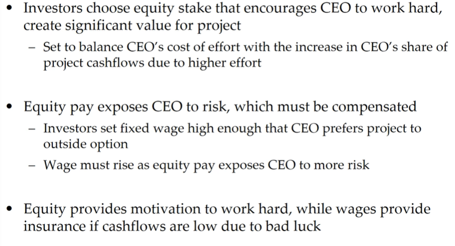
  - 
- Summary of Governance using Equity Pay
  - 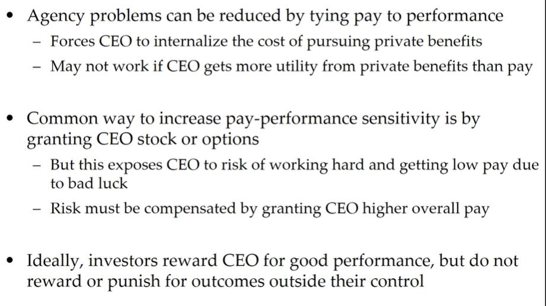
  - 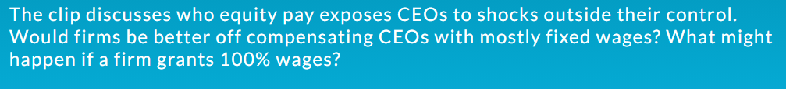