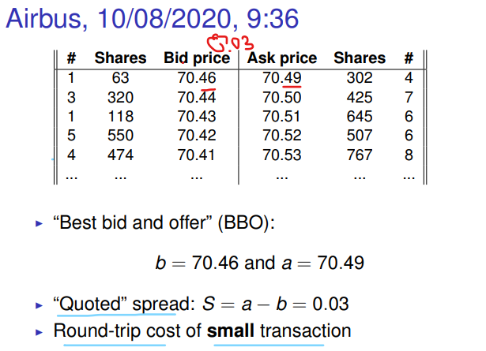
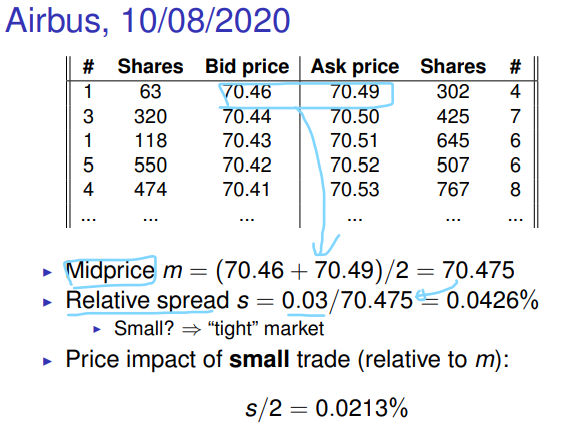
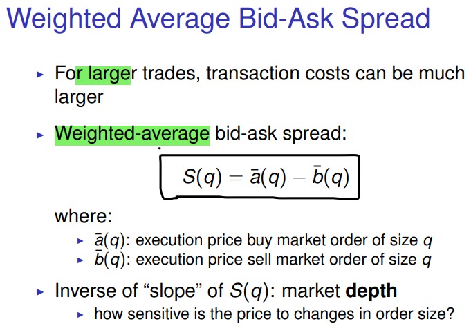
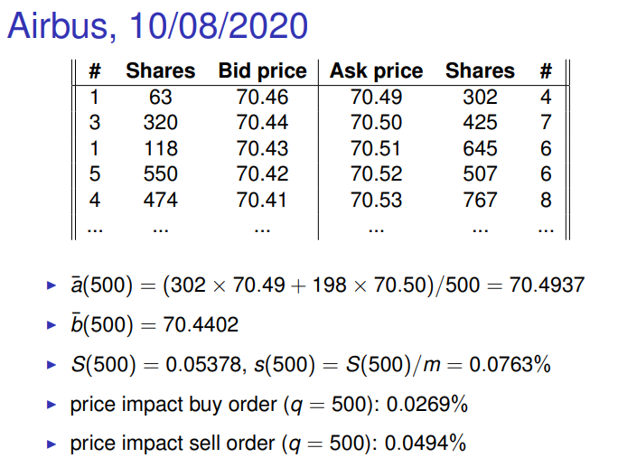
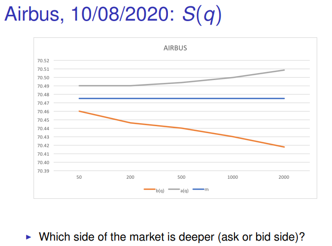
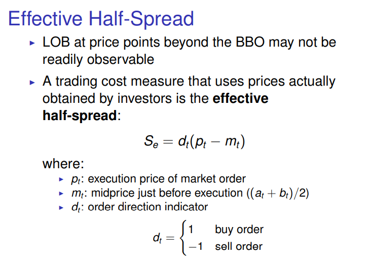

# This Week: Market Liquidity
    - The 3 dimensions of market liquidity
    - Measuring liquidity in practice
    - Amihud’s (2002) illiquidity measure
    - Roll’s (1984) bid-ask spread estimator
    
- Market liquidity definition

- The 3 dimensions of market liquidity
  1. Market Tightness: How **small** is the **spread**?
  2. Market Depth: What’s the **price impact** of (large)
  orders?
     - deep market = little price impact
  3. Market Resiliency: How quickly is liquidity
  replenished?
     - how fast do new quotes arrive?
     - liquidity 복구속도

- **Spread 정리**
  - *Quoted spread*
    - Ask - Bid
  - *Relative spread*
    - Quoted_spread/mid_price
      - Mid_price = (Ask + Bid)/2
  - *Weighted average spread*
    - Average Transaction price(Ask) - Average Transaction price(Bid)
  - *Effective **half** spread*
    - direction x (Transaction_price - mid_price)
      - Direction
        - Buy  : -1
        - Sell :  1
      - Mid price
        - 실행 바로 이전의 중앙가격
  - *Effective spread*
    - Mid_price - transaction_price
  - *Realized half spread*
    - dt(transaction_price - m_1)
      - m_1: mid price after the transaction

- 
- 
- 
- 
- 
  - Price of sell orders are more sensitive
- 
