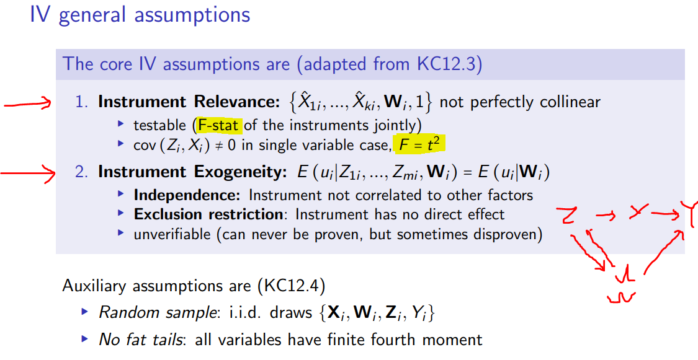

- Instrumental Variables
    -  Assumes that variable Z is exogenous (in stead of X)
    -  Estimation and testing
    -  Internal validity
- Heterogeneity
    - ▸ Students, people, firms, counties, observational units i in general have different effects β1i
    - ▸ Consequence for
    - ▸ OLS : ATE
    - ▸ Instrumental Variables: LATE

 - Omitted Variable Bias in the returns to education
    - 
    - 
    - 
    - 
      - ability를 어떻게 측정하냐가 문제
# Part B instrumental Variables -  Method

- 
- 
- 
- 

## Core assumptions & distribution
-   
-   
-   
-   
-   

## Estimation and testing

- 
- 

# Part C

- 
- 
- 
- 
- 
- 
- 