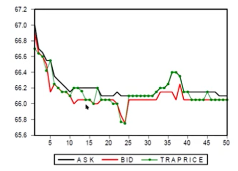
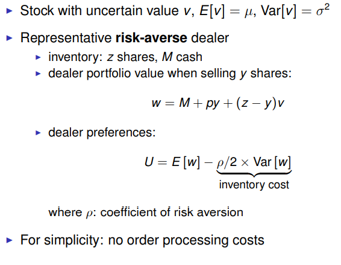
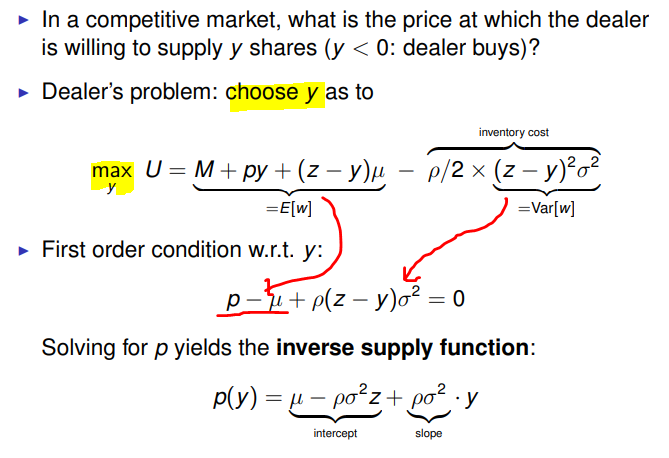
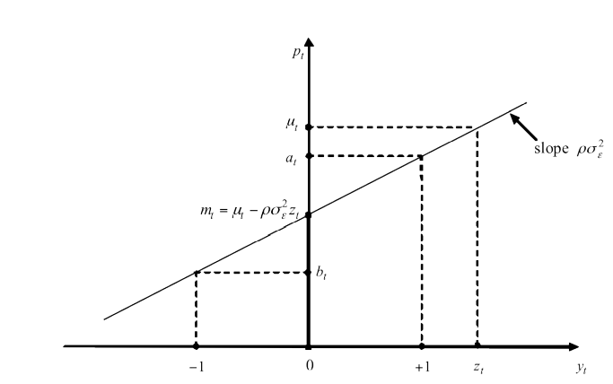

##  목차
  - Why and how do orders move prices?
  - Why are markets not perfectly liquid?
  - What risks and costs do market makers face?
  - What is inventory risk and how does it affect prices?

## Intraday Price Fluctuations and Order Flow
  - 
    - price falls with sell orders and rises with buy orders
    - considerable movement, despite absence of news
    - returns (price changes) are negatively correlated (−0.45)

## Why do orders move prices?
  -  Orders move prices because markets are not perfectly liquid
  - But then why are markets not perfectly liquid?
  - Why do liquidity providers (e.g., market makers) not ensure that markets are perfectly liquid?
  - What are costs/limits to liquidity provision?
  - What risks do market makers face?

## Market Makers
  - Market makers (aka dealers, liquidity providers):
    - trading firms that provide liquidity
    - quote prices at which they are willing to buy and sell
    - provide immediacy: investors can trade immediately
  - Pure dealer markets (e.g., corporate bonds, FX):
    - mostly banks
  - Exchanges / limit order markets:
    - banks
    - non-banks, e.g.:
      - Optiver: www.optiver.com
      - All Options: www.alloptions.nl
      - IMC: www.imc.nl
      - Flow Traders: www.flowtraders.co

## What do MMs do? The Case of Flow Traders
  - “Flow Traders is a leading global technology-enabled liquidityprovider specialised in Exchange Traded Products. We are an independent principal trading firm. Our trading desks in Europe, the US and Asia enable us to provide liquidity on all major exchanges, 24 hours a day. . . . We are a principal trading firm and do not have clients or offer investment services. We trade for our own account only.”
  
  - www.flowtraders.com/about/video-what-we-do

## How do MMs earn money?

-  MMs make money in various ways:
   - bid-ask spreads
   - proprietary trading profits
   - exchanges may pay them
   - flip side: MMs may have to commit to provide minimum levels of liquidity in terms of minimum volume and maximum spread
   - such MMs are referred to as “designated MMs” or “sponsors”

## What risks/costs do MMs face?
  - MMs face three major types of risks:
    - 1. **inventory risk** - risk due to **price fluctuations**
    - 2. **adverse selection risk** - risk of trading against **better informed** parties
    - 3. **picking-off risk** - risk of trading against **“faster”** parties
      - faster access to new information
      - quicker reaction to new information
  - Other costs include
    - order processing costs
    - infrastructure, technology, employees
  - ⇒ MMs must generate revenue to compensate for
    - 1. adverse selection costs & picking-off risk (next week)
    - 2. the costs of bearing inventory risk (this week)
    - 3. other costs, including order processing costs (this week)

## Frictionless Benchmark
  - To start with, consider the following benchmark setting:
    1. dealers are risk-neutral and perfectly competitive
    2. no adverse selection/picking-off concerns
    3. no order processing costs
  - Let µt denote stock’s fundamental value at time t
  - How does a dealer set his bid and ask quotes?
    - profit from executing buy order (dealer sells):
      - at − µt = 0 ⇒ at = µt ???? 파는 사람 입장?
    - profit from executing sell order (dealer buys)
      - µt − bt = 0 ⇒ bt = µt ????
  - Conclusion: no spread, transaction prices = fundamentals

## Order Processing Costs
- Order processing cost c > 0 per share traded:
  - profit buy order (dealer sells):
    - at − µt − c = 0 ⇒ at = µt + c
  - profit sell order (dealer buys):
    - µt − bt − c = 0 ⇒ bt = µt − c
- Conclusion:
  - positive (but constant) spread: at − bt = 2c > 0
  - transaction prices != fundamentals
  - deviations from fundamentals are **transient**: while the type of order (whether we have a buy or sell order) at time t matters for the price at time t, it does not matter for future prices
    - not realistic: orders often have lasting price impact!

## Inventory Risk
 - Next, suppose that dealers care about inventory risk because, e.g.:
    - limited capital/funding liquidity
    - financial distress costs
    - regulatory capital requirements (banks)
    - imperfect and/or costly hedging
- If dealers are risk-averse, they must be compensated for the corresponding inventory holding costs ⇒ bid-ask spread
- Simple model to analyze inventory risk, based on Stoll (1978)

## Inventory Risk: Simple Model
  - 
    - y: quantity
## Inverse Supply Function
  - 
  - 