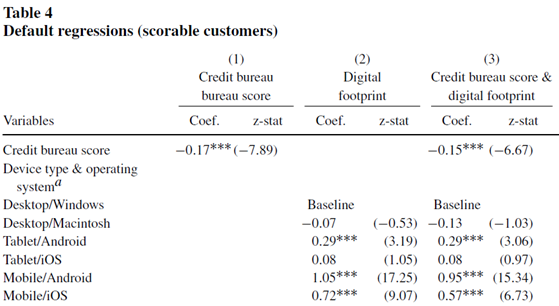
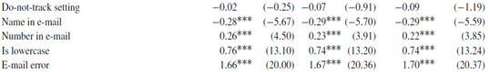
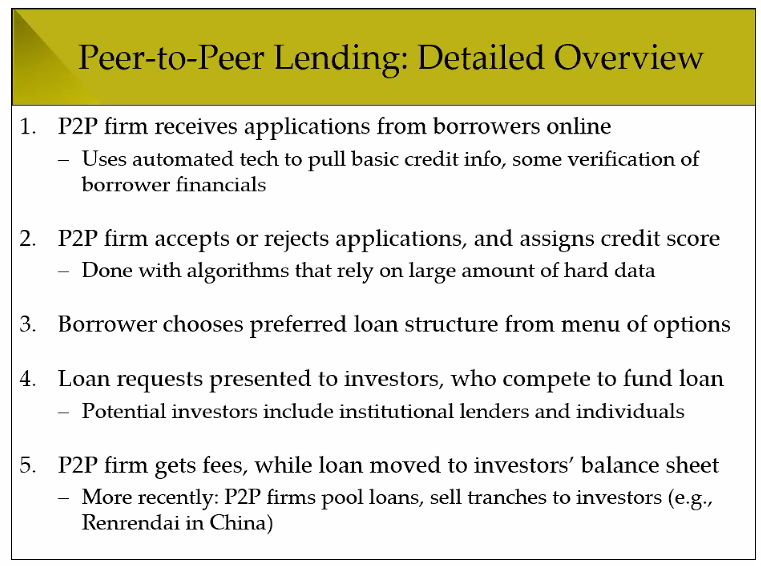
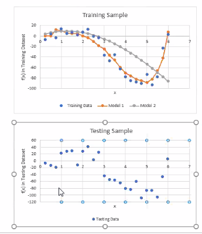

- ## Q1.Big Data and Bank Lending    
  - a. Briefly describe two comparative advantages that a bank has over a FinTech firm for evaluating the creditworthiness of loan applicants. 
    - Why bank better than fin tech firms
      - More experiece/experise
      - Info from long-term relationships
     
  -  b. Charles Schwab Inc. combines banking and brokerage services: Any client with a bank account can also open a brokerage account, and enjoy a 50% discount on trading fees. Trade discounts cost Schwab -3 per year. Each year, Schwab offers loans that mature in 2 years, have principal of 100, and pay an annual interest rate of 12%. Schwab’s cost of capital is 5%. 
    - **annual interest** : 매년 이자를 번다는 것, 마지막 해는 원금 + 이자

    - The pool of loan applicants is split equally between good and bad borrowers. A good borrower repays the loan in full. A bad borrower makes the first coupon payment, but misses the second coupon and repays only 75% of principal. Schwab can’t distinguish between good and bad borrowers. But if a good borrower also has a brokerage account, then Schwab obtains a signal that their application is good with probability p > 0.5. 
      
     - Suppose Schwab receives one loan application per year with a “good” signal. Is bundling a positive NPV project for Schwab when p = 0.8? What if p = 0.66?
    
    - ## Answer
      -  NPV = -3 + 100 + 0.8 *(12/1.05 + 112/1.05^2) + 0.2(12/1.05 + 75/1.05^2) =  3.3
      - NPV = -3 + 100 + 0.66*(12/1.05 + 112/1.05^2) + 0.34(12/1.05 +75/1.05^2) = -2.8

  - c. A discount online brokerage enters the market and offers free trading to all users. It captures 200,000 of Schwab’s users, and reduces those users’ annual trading fees by €200 on average. But each year 10% of these users would like to apply for a loan from Schwab. Each loan would be used to start a business that generates NPV of €2,500. The users cannot get a loan from elsewhere. Is the discount brokerage’s entry good or bad overall for brokerage users? 
  
    - 200,000 users * 200 EUR =  40M EUR
    - 0.1*200,000 users * 2,500 = -50MEUR from foregone NPV 

- ## Q2. Digital Footprints and Credit Scores
  -  a. Below is an excerpt of Table 4 from Berg et al. (2020). The dependent variable is a binary indicator that equals 1 if a customer’s debt claim was transferred to a collection agency. The explanatory variables include credit scores and the operating system used by the customer. “Desktop/Windows” is the baseline, so other operating system coefficients are relative to this group.
  -  Describe the key findings from each regression column. What could explain the relationship between default rates and mobile operating systems?
    - 
      - Answer
         - Desktop/Windows is excluded. 이거는 기준 점
         - Desktop/Macintocsh
         - Mobile phone는 더 default 가능성 높음

         - 세번째 열에서 알 수 있는 것 
         : Credit score is capturing somethings that types of systems do not capture

         - Mobile phone situation would be more natural or busy so buyers become more imperse
         - Mobile phone users could be younger
         - iphones are relatively expensive than Android

  
  - b. Below are coefficients on additional explanatory variables from the regressions. What could explain the relationship between default rates and “Name in email”, or “Is lowercase”?
    - 
    - Answer
      - Customer fraud?
        -  Name in email (@uva.nl)more negatively correlated >> Highly educated >> richer
        - Everything in lower case. >> Low education or careless >> More default rate
         
      -  These variable are capturing something cwe can’t obeserve

- ## Q3.FinTech Disruptions of Traditional Finance
  - a. Describe a typical peer-to-peer lender’s role in the loan process.
    - 
      - 온라인으로 대출 하는 것
        - 단계
          - 지원자 받음
          - 승인/거부 결정/ 신용 등급 결정
          - 빌리는 사람 옵션 정함
          - 대출자 정함
          - p2p 수수료 받음
  - ## b.전통은행이 대출해주는 경로
    - 은행의 위험규제가 중요한 이유
       -  우리가 돈을 넣으면 은행은 그 돈을 다른데다 쓴다.
       -  Banks takes a lot of risk with consumer's deposit. So they can't pay
       -  Deposit insurance can be. This case government face the cost
       -  정부나 다른 사람이 그 위험의 여파에 휩쓸린다.
  -  c. peer to peer lender 가 은행 만큼 규제를 받지 않은 이유
    - This is not moving money. So they don't fit the legal definition ot the banks
    - They are not taking money from ordinary individuals
    - ## One implication
      - ## Because they are not highly regulated as banks, they can make a loan that banks don't want to do
      - ## Since 2008, there happended a lot of regulation for the bank >> Costly for banks to make a loan
    - Example of **shadow banking**
      - Def: any type of bank that do not belong to ordinary bank definition
      - 
- Q4. Tradeoffs in Statistical Learning
    -  a.The top chart below shows a set of data points in a training sample (blue dots) along with two estimated models that attempt to fit the data (orange and gray lines). The bottom chart shows a different set of data points, in a testing sample. 
    -  Which model in the training sample has higher bias? Which model is more likely to have higher variance, when applied to the testing sample? 

    - 
      - Training data 에서 variance가 높고 그리고 모델이 복잡하면 Test에서 예측 정확성이 떨어진다.
      - 오렌지색은 train에서 bias가 더 낮음 그래서 variance가 높음
      - 회색 train에서 variance가 높다 그래서 bias 낮다
  - b. A data analytics firm is designing an algorithm to read through job applications and select the top 10% of resumes. The training dataset consists of all past hiring decisions made in an industry that has 80% male employees. What problem could result if the firm chooses a model with low bias (i.e., that fits the training dataset very well)? 
    - algorithmic bias
    - Traning dataset is not representative of the population