# Topic 1: Intro to Financial Distress

- ## Financial distress and continuation value
  - 대부분의 distress firms들은 equity financing 이 주류이면 수지맞게 회사를 운영할 수 있다.
  - Low continuation value may be liquidated in bankruptcy
- ## Distress and continuation value
  - 
  - 
    - 돈 빌려준 사람이 Debt value = 성공확률*(원금+이자) 실패확률 (0원) 를 계산하고 
      - 회사 자산이(Liquidation) Debt value 보다 작으면 돈을 빌려주는 것을 피하라는 것
  - 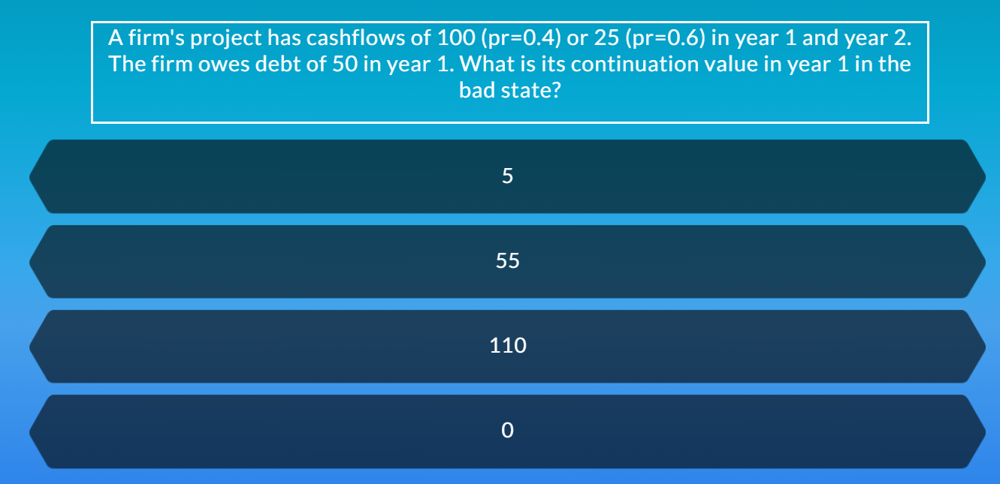

# Topic 2: Mesuaring Distress Empirically

- Mesuaring Distress Empirically
  - z-score, Distance to default 로 측정
  - 
- ## z-score
  - 단점
    - 1. 과거의 데이터에 기초, 따로 이론 없이
    - 2. accounting data에 기초
    - 3. off-balance-sheet liabilities가 있는 회사들한테는 적용 안됨
  - 
- ## Distance-to-Default (D-D)
  - 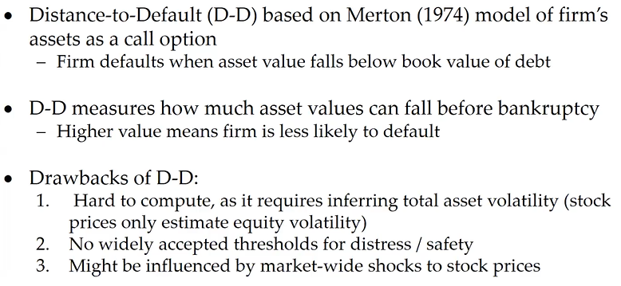
- ## Other distress idicators
  - Credit rating, Credit default swaps
    - 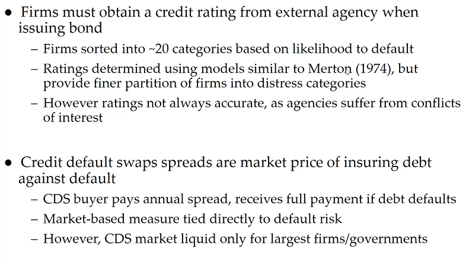
    - 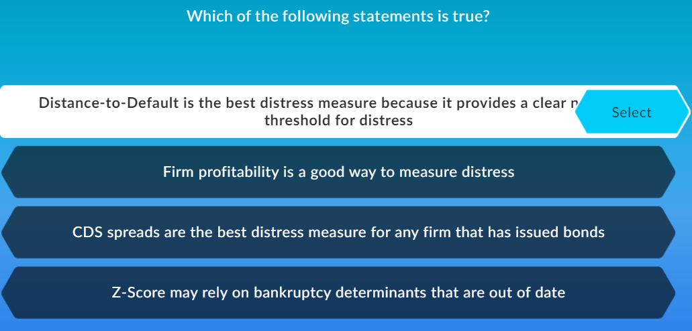
   
# Topic 3: Overview of Bankruptcy 

- ## Bankrup vs insolvent
  - 회사 파산이유: 투자의 NPV 가 liability 보다 낮을 때 
    - 회사가 debt를 못 갚음
    - ㅇ
  - Insolvent 회사는 NPV는 debt 보다 큰데 현금이 없어서 지금 당장의 빚을 못갚는 것
    - 이런 회사는 시장이 좋아지면 상태가 다시 좋아질 수 있음
- ## Overview of bankruptcy in U.S
  - 빌린 돈을 같은데에도 우선 순위가 다르다.
    - Secured lender, senior bondholders, junior bondholders, preferred equity
  - Chap 11, Chap 7 에 내용 있음
  - 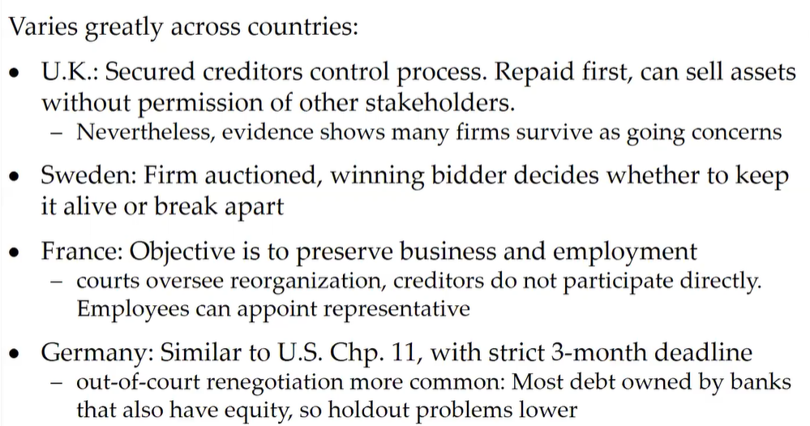
  - 
  
# Topic 4: Example of Precautionary Savings
## Important

- ## Simple example of precuationary saivings
  - 회사 good or bad
  - 투자 or Save?
  - 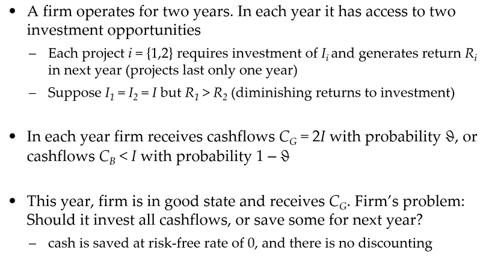
  - 
  - 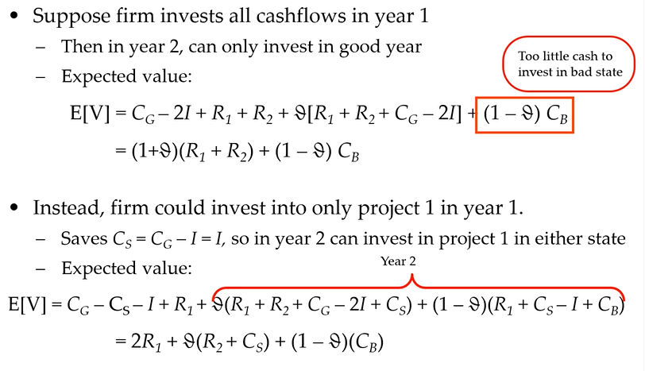
  - 왼쪽 saving, 오른쪽 투자
    - 

# Topic 5: Empirical Evidence on Distress Costs
- ## Overive of distress costs
  - 
    - Default >> Direct costs
    - Distressed >> Indirect costs  
- ## Direct costs of distress 
  - 
- ## Indirect costs of distress
  - 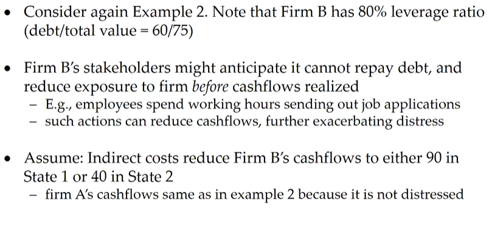
  - 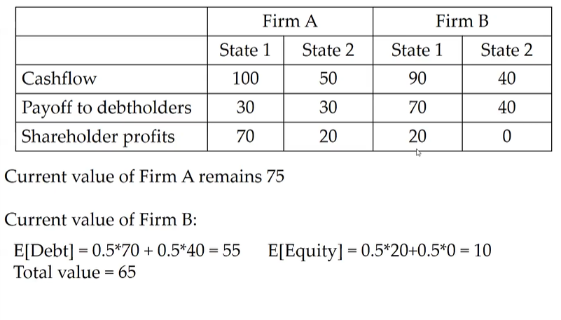
  - 
  - 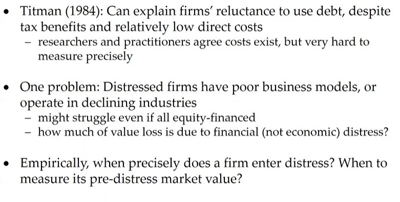
  - 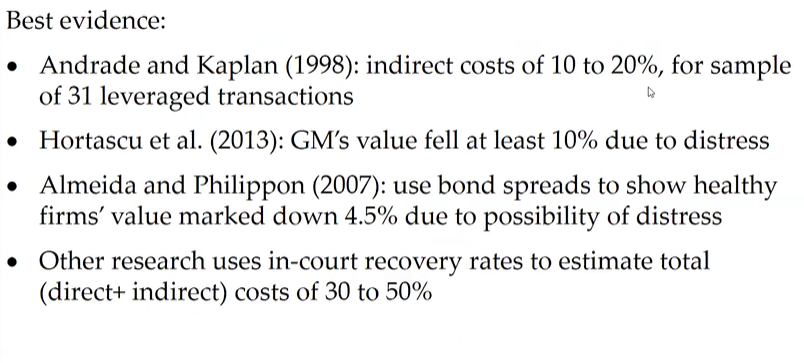
- 
- 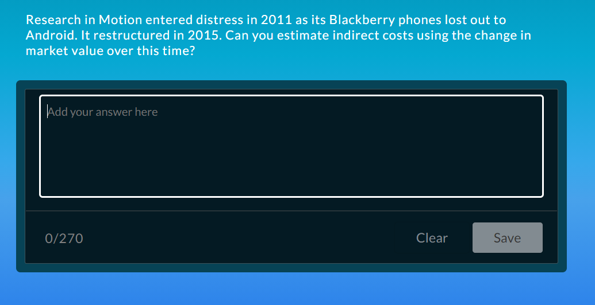

# Topic 6: Can Reneotiation Prevent Distress?

- Why go into costly distress?
  - d
  - Renegotiating debt out of court is difficult or costly

- ## Example 5: Restructuring out of court
  - 

  - 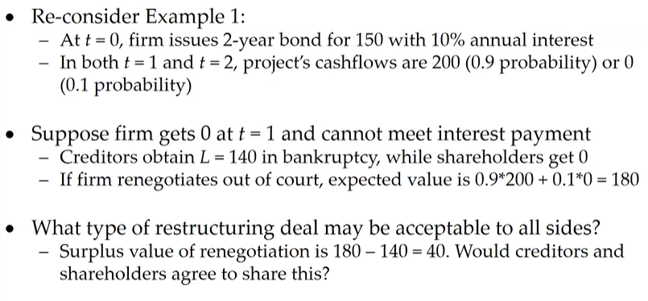
  - 