# Topic 1: Intro to Financial Distress

- Financial distressed: 회사가 미래에 빚을 못갚을 확률이 높은 것 
- Default : 빚을 못 갚은 상황

- ## Financial distress and continuation value
  - 대부분의 distress firms들은 equity financing 이 주류이면 수지맞게 회사를 운영할 수 있다.
  - Low continuation value may be liquidated in bankruptcy
- ## Distress and continuation value
  - 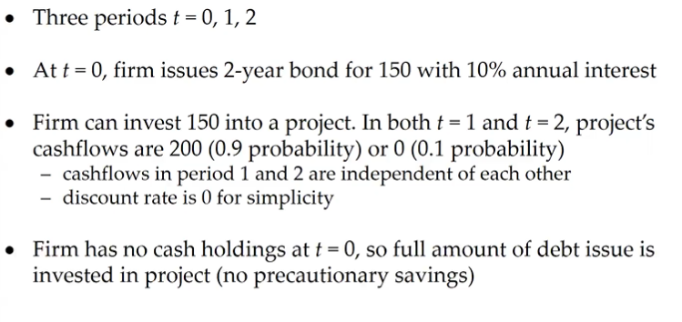
  - 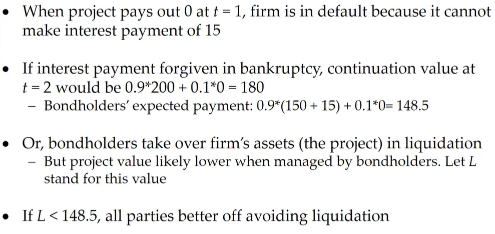
    - 돈 빌려준 사람이 Debt value = 성공확률*(원금+이자) 실패확률 (0원) 를 계산하고 
      - 회사 자산이(Liquidation) Debt value 보다 작으면 돈을 빌려주는 것을 피하라는 것
    - Continuation value: 미래가치
    - L : liquidation을 할지 말지 결정하는 가치 (Continuation value가 L보다 낮으면 liquidation한다.)
  - 

# Topic 2: Mesuaring Distress Empirically 외우기!!

- Mesuaring Distress Empirically
  - z-score, Distance to default 로 측정
  
- ## z-score
  - ## 단점
    - 1. 과거의 데이터 패턴에 기초, 따로 기본이론 없음
    - 2. accounting data에 기초
    - 3. off-balance-sheet liabilities가 있는 회사들한테는 적용 안됨
  - 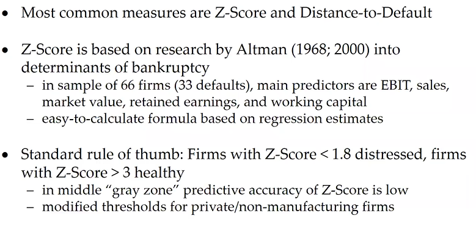
  - 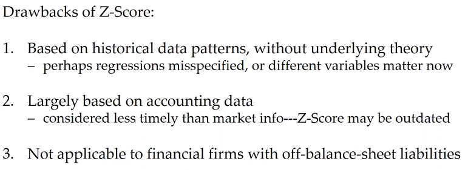
- ## Distance-to-Default (D-D)
  - 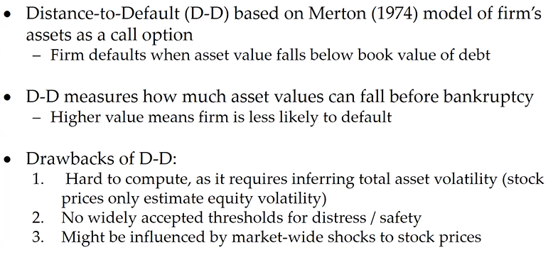
- ## Other distress idicators
  - Credit rating, Credit default swaps
    - 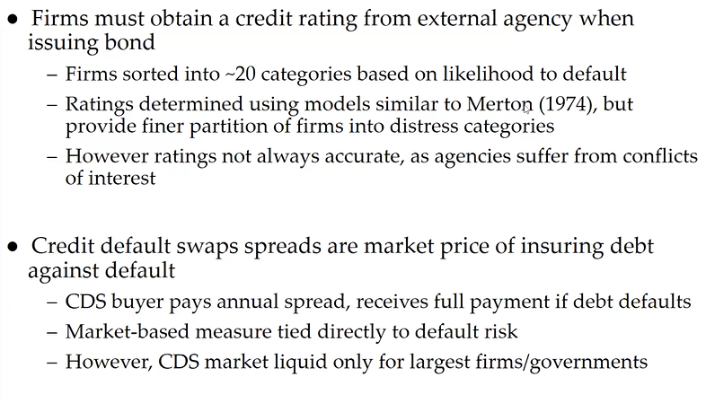
- 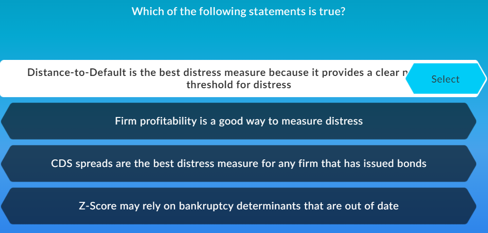
   
# Topic 3: Overview of Bankruptcy 

- ## Bankrupt vs insolvent
  - 회사 파산이유: 투자의 NPV 가 liability 보다 낮을 때 
    - 회사가 debt를 못 갚음
  - **Insolvent** 회사는 NPV는 debt 보다 큰데 현금이 없어서 지금 당장의 빚을 못갚는 것
    - 이런 회사는 시장이 좋아지면 상태가 다시 좋아질 수 있음
- ## Overview of bankruptcy in U.S
  - 빌린 돈을 같은데에도 우선 순위가 다르다.
    - ## Secured lender >> Senior bondholders >> Junior bondholders >> Preferred equity
  - Chap 11, Chap 7 에 내용 있음
  - 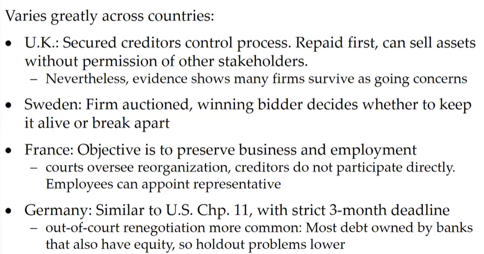
  - 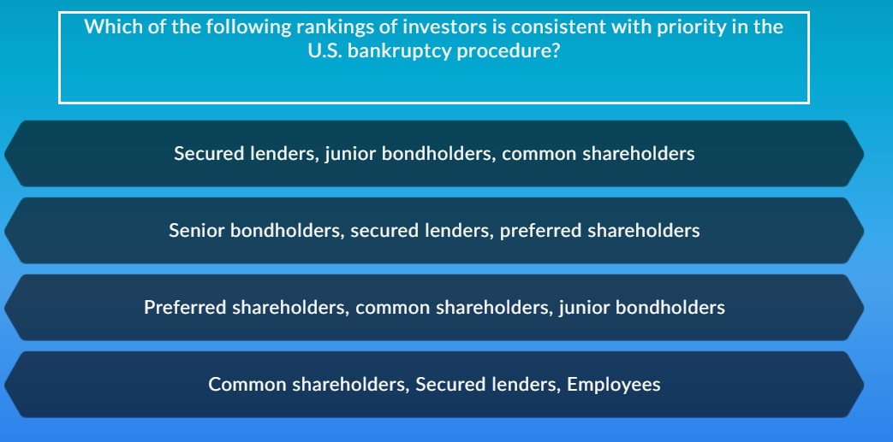
  
# Topic 4: Example of Precautionary Savings
## Important

- ## Simple example of precuationary saivings
  - 회사 good or bad
  - 투자 or Save?
  - 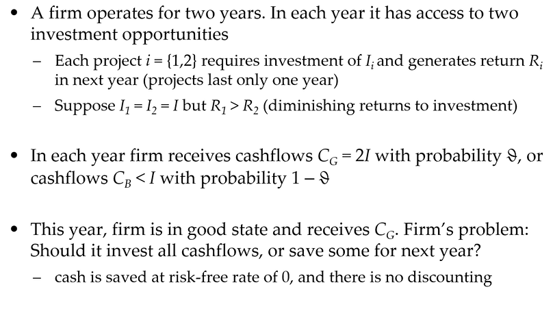
  - 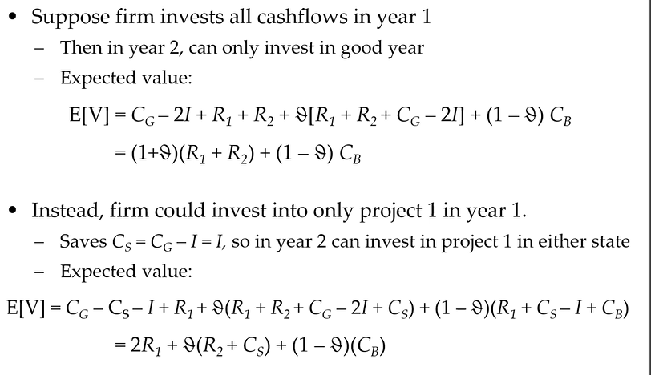
  - 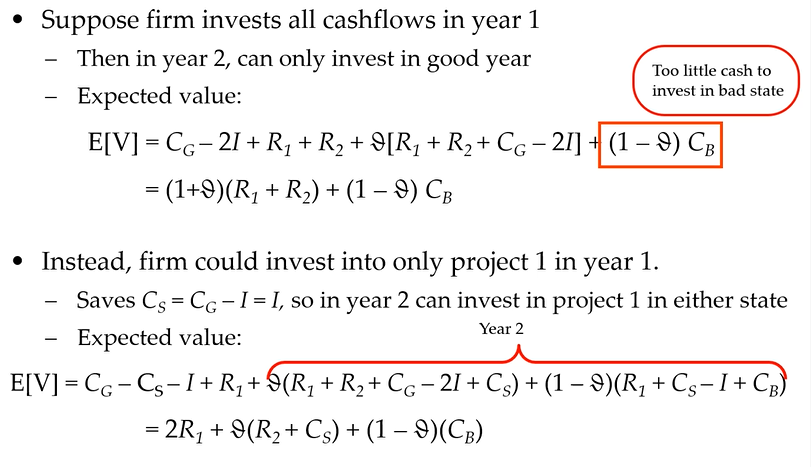
  - 왼쪽 saving, 오른쪽 투자
    - 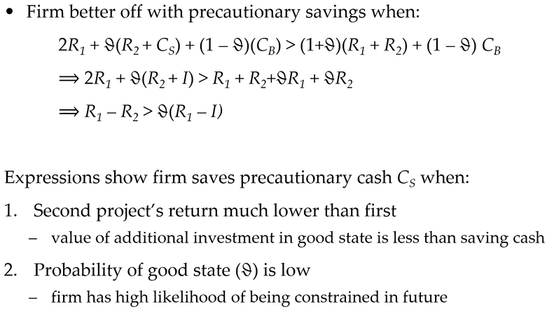

# Topic 5: Empirical Evidence on Distress Costs
- ## Overive of distress costs
  - 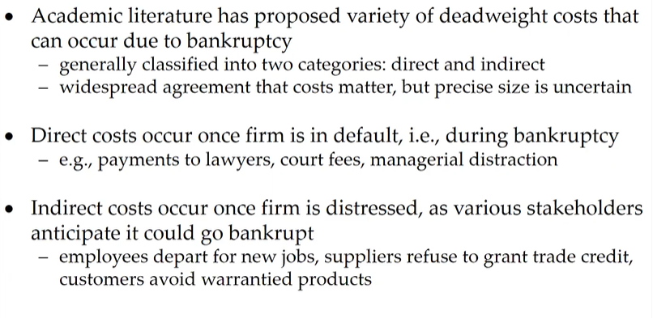
    - Default >> Direct costs
    - Distressed >> Indirect costs  
- ## Direct costs of distress 
  - 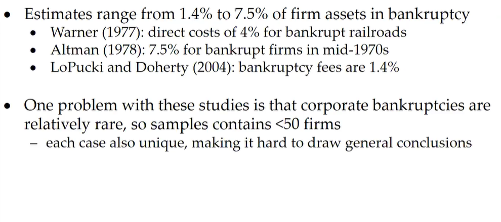
- ## Indirect costs of distress
  - 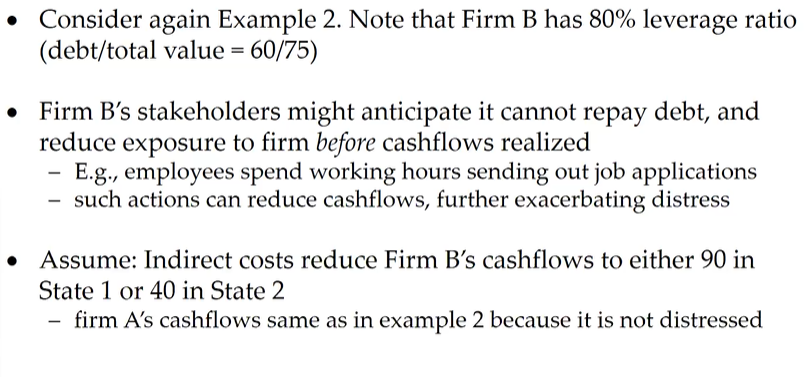
  - 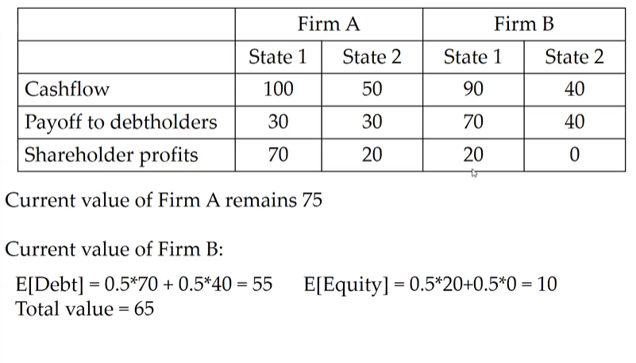
  - 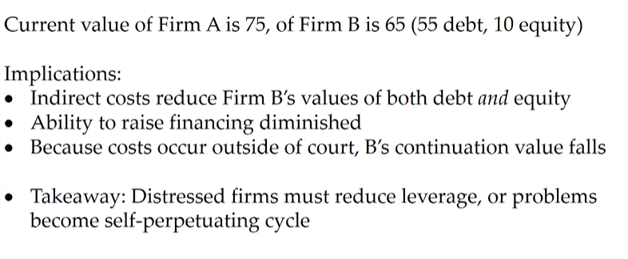
  - 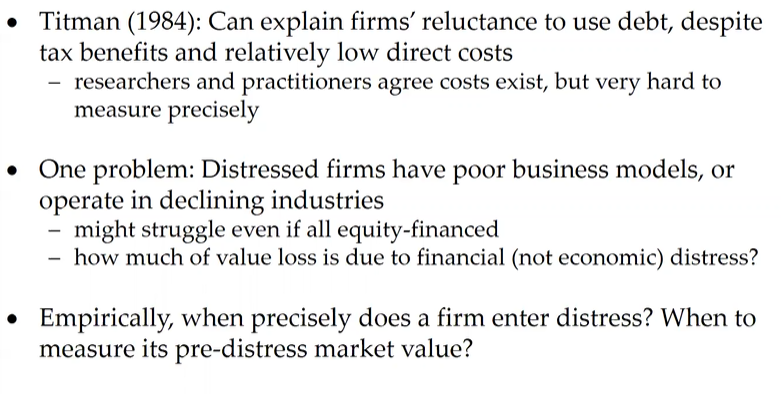
  - 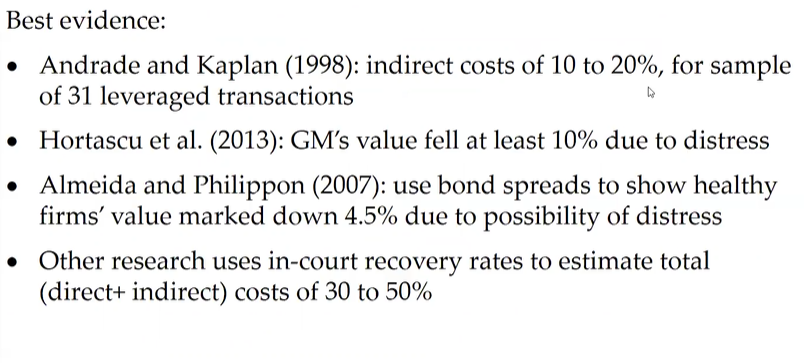
- 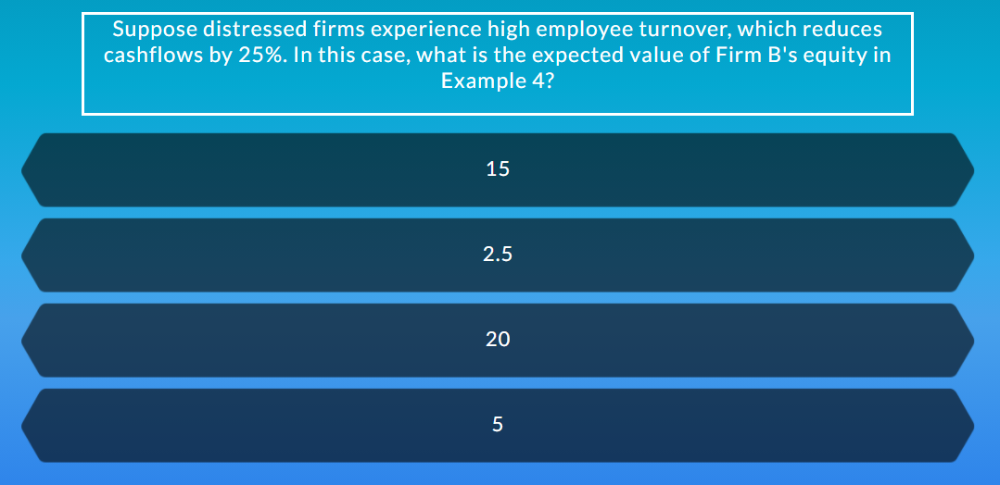
- 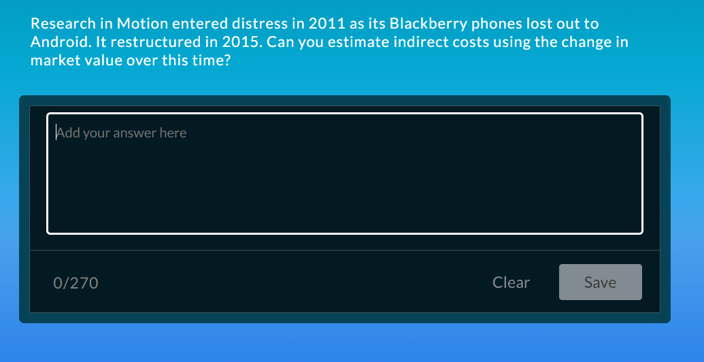

# Topic 6: Can Reneotiation Prevent Distress?

- Why go into costly distress?
  - d
  - Renegotiating debt out of court is difficult or costly

- ## Example 5: Restructuring out of court
  - 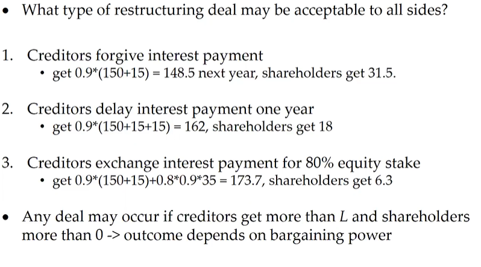
  - 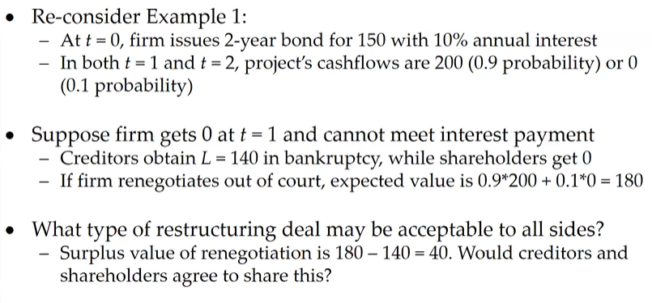
  - 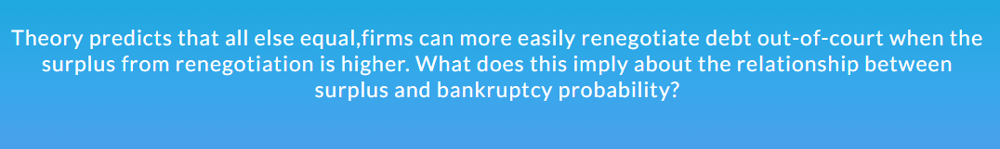

# Problem and solution

## 1. Cost of financial distress
   - ## a. 
     - Explain the difference between direct and indirect costs of financial distress. 
     - ## Direct cost
       - incurred only during bankruptcy
       - 파산했을 때만 생김
     - ## Indirect costs
       - incurred starting from when a firm first becomes financially constrained
       - 재정적으로 곤란해지면서 생기는 것

   - ## b. 
     - Firm A and Firm B have access to the same investment project, which generates cashflows of either 80 or 40 next year with equal probability. The only difference  between the firms is that A has issued debt of 20 while B has issued debt of 60. Is either firm financially distressed? If yes, provide one reason why the distressed firm’s current value could be lower than the non-distressed firm.

       - *Answer*
         - 핵심 용어: **Distress costs**
        - Firm B is financially distressed because there is a high chance it will not repay its debt in the near future. Its value will be less than that of A because it may experience deadweight distress costs

         - Firm A -> will not default on it debt in both states -> debt of A is risk free
         - Firm B -> will default in bad state 40<60
         
         ## why value of firm B today < value of firm A?
         - Value of A = value of equity + value of debt = value of asset = expected value of all cashflows = 0.5x80 + 0.5x40
         - Value of B = expected value of all cashflows (equity + debt) = 0.5x80 + 0.5x30(?)
           - 30으로 적은 이유는 B회사는 **distress cost**로 인해서 손해를 보았기 때문에 A 회사 40 보다 낮아야 하기 때문이다. 30은 임의로 정한 수
   - ## c. 
      - B 회사에서는 indirect cost 때문에 8씩 뺀다
      - Debt holder 에게는 cash flow에서 돈 다 빼서 우선 준다.
      - 
      - Difference of values:

## Q2. Restructuring debt out of court
  - ## a
    - 
    - Two options for creditors
      - 1.Restructure debt? : 60 + E(future profits)
      - 2.Bankruptcy court? : 70 = cash - bankruptcy fee + asset value(by liquidating) 60-40+50
      - bankruptcy fee : 채무자들이 회사를 처분할 때 내야하는 비용
    - E(future profits) < 10, choose for 2
  - ## b
    - 
    - blue part is a very strong assumption
    - Two options for creditors
      - 1.Restructure debt? : 90 = 60 + 30
      - 2.Bankruptcy court? : 70 = cash - bankruptcy fee + asset value(by liquidating) 60-40+50
    - E(future profits) < 10, choose for 2 
    - Two options for firm:
      - 1.Restructure debt? :  0 + E(future profits)
      - 2.Bankruptcy court? :  0
        - 왜 0? 어차피 이득보는거는 없음 미래를 노려볼 수는 있다.
  - ## c
    - 
    - Two options for creditors
      - 1.Restructure debt?
      - 2.Bankruptcy court? : 
        - 

## Q3 Creditor coordination
  - ## a.
    - 
    - Holdout(채무 재조정을 거부하는 문제)
    - The holdout problem occurs when *some creditors are owed significantly more than others*. Small creditors may attempt to sit out a renegotiation, because they anticipate that the larger creditors will take most of the haircut as they have more money at stake.
    - 채무가 조금만 있는 사람들이 채무가 많은 사람들이 거의 다 가져갈까봐 채무 재조정을 거부하는 것
  - ## b.
    - 
    - Bankruptcy: 55 (cash- bankrupty fee = 85-30); A:0.6 x 55=33; B,C,D,E
    - Out of court renegotiation: A:100 x 0.6 -15 =45 (A가 100에서 85로 깎인 만큼의 손실을 전부 떠받음); 85-45=40 이만큼을 B,C,D,E가 또 나눔(?)
    - 
   