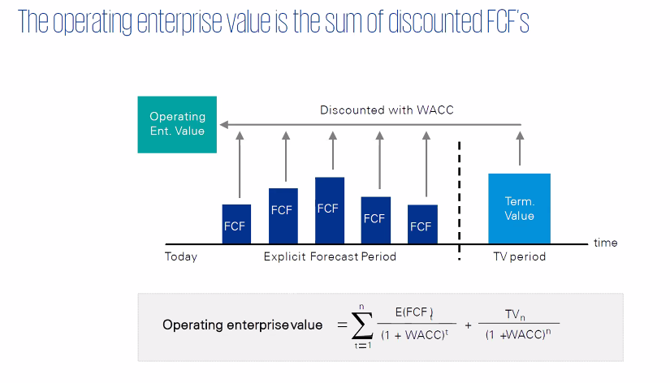
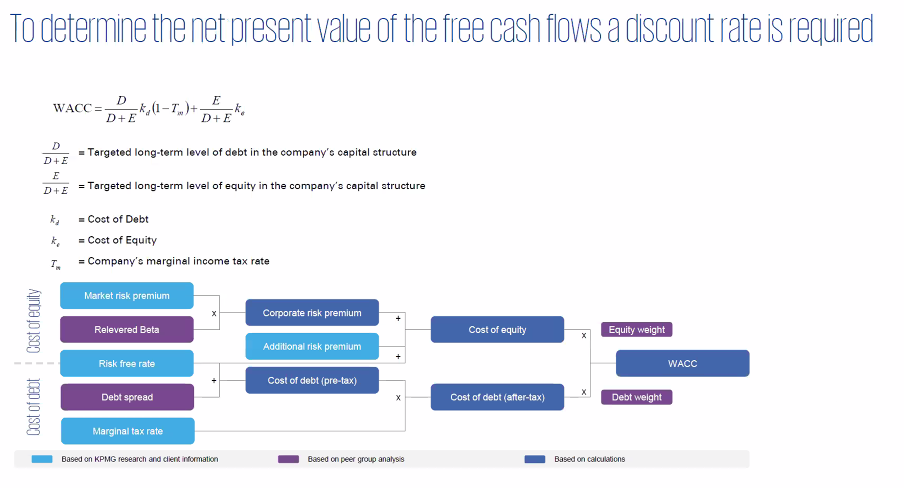
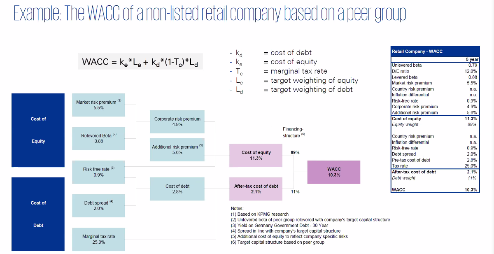
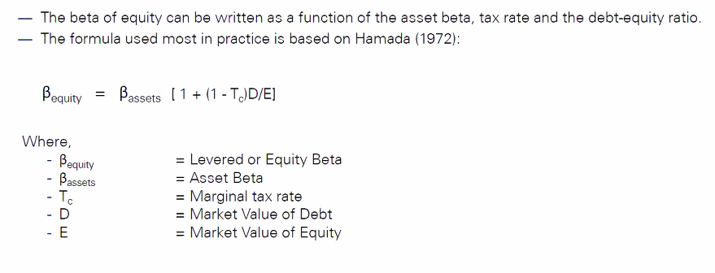

# Introdcution to valuation theory

  - ## Price vs Value

- Discounted Cash Flow
  - FCF
    - all about cash generation for providers of funding
    - FCF/WACC model
      - 
- Market based valuation
  - Trading multiples
  - Transaction multiples
- Discounted Cash Flow (DCF) approach
  - FCF
  - WACC
    - 
    - 
  - Terminal value
    - RONIC

- Forecasting story line
  - Industry perspective + Firms perspective

- Others
  - Market risk premium = Toral requred reutrn - risk free rate

- Beta
  - Business Risk
    - Industry Risk
    - Operating Leverage
  - Fin leverage(D/E)
  - Equity risk
  - 

- Capital structure

- Market multiples within a valuation context

- Types of trading multiples and appropriate applications
  - Earnings Multiples
  - Sales Multiples
  - Market to Book Multiples
  - Industry Specific Multiples
  