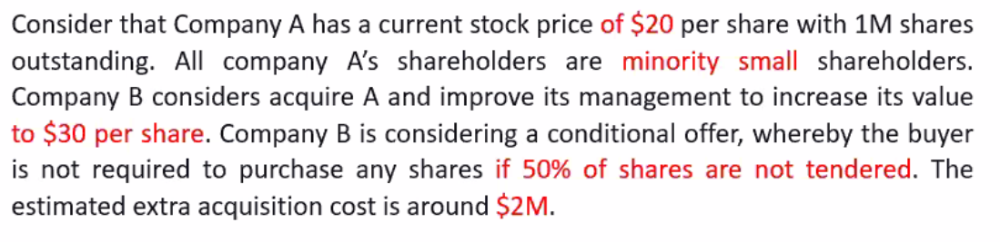

- Outline
  - Intro
  - M&A Stratgies
  - .
  - .

- ABN AMRO M&A
  - 
- M&A Historical Trends

# M&A stragteges
  - Acquring firm
  - Target firm  
- Value Creation

- ## Operating Stnergies
  - Horizontal
    - 경쟁사들끼리 합병
  - Vertical
    - 공급자 소비자 사이 합병
  - Economics of scope

- ## Financial Stnergies
  - Internal Capital Market(ICM)
    - *Redeploy* funds across firms to investments
  - Cash Cow
    - merge with Finance Junkies
  -

- ## Mangement Synergies
  -   d
  -  Diciplinary Takeovers
     -  bad manged firms를 노린다.
     -  Dysfunctional organization을 노림
  - Note: Takeover threat could incite discipline
# Value transfer
  - Tax savings
    -   use other firms' unused tax deductions

  - Cut employee benefits
    -   Common belif
          -   wage renegotiations
  - Existing creditors
## Bad Acquisitions
  -   Mistakes in valuation or winners' curse
  -   Governance problems
      -   Bidder empire buildings
      -   d
## Stock Market Reactions
  -   d
  -   ## Merger Event Study
      -   Choose event window
      -   Market model
      -   Estimate abnormal returns on each day of event window
      -   Cumluative abnormal returns (CAR
      -   Returns to target firms
          -   d
      - Returns to bidders
       

# Topic 3
-  ## Valuation
   -  1. Target as a Stand Alone Firm
   -  2. Calibrate the Valuation Model
   -  3. Value the Synergies
       - no go might not imply status quo
             - staus quo:
             - 선택 안하면 변한다.
# Topic 4
- ## Execution

- ## Financing
  - Cash
  - Stock
    - Issues new shares to be exchanged
  - Combination
- ## Defense
  - Poison pills

# Tutorial problems
- q1.
  - Data: Daily stock return, Target,bidder, market
  - Sample
    - Event window
    - -120 before event window
  - Measure
    - Market model
    - Abnormal return = realized return - expected return (alpha, beta, market return)
    - CAR
    - 
- q2. Bad Acquisition
  - main reasons of bad acquisition of ABN-AMRO
    - 1. Premium too high
    - 2. High leverage
    - 3. Bad time
    - 4. splited deals
    - 
- q3. M&A execution
  - 
  - a.
    - 1.Tender/accept to sell at the bidding price
    - 2.Not Tender/Hold current shares
      - ㄱ) payoff is 30 if not tender> 21 if tender conditional on successful deal; failure of the deal: 20
      - ㄴ) 2M losing moeny
      - 
  - b.
    - 
      - Tender >= not tender (Include When payoff is the smae) -> success bid
  - c.
    - profits = benefit- cost = 30x1 - (bidding cost + extra cost) = 30 -(30x1 +2)
  - d.
    - 

# Paper discussion

- ## What is the motivation of the acquisition the paper suggests?
  - Inefficient market, rational managers, arbitrage.
  - 
  - We propose a theory of acquisitions related to the neoclassical theory, but also
able to accommodate the additional evidence. In this theory, transactions are driven
by stock market valuations of the merging firms.

- ##  What does the model trying to explain?
  - Participants, the payments
  - 
  - Model helps explain who acquires whom, the choice of the medium of
payment, the valuation consequences of mergers, and merger waves.

- ## What are the empirical predictions of the model? Short run? Long run?
  - 
    - short term 1,2,3
    - Long term 5,6,7 
  - 

- https://www.sciencedirect.com/science/article/abs/pii/S0304405X03002113
