---
title:  "FM-W4-Adverse selection"

categories:
  - UvA_Financial Markets
tags:
  - The 3 dimensions of market liquidity
  - Measuring liquidity in practice
  - Amihud’s (2002) illiquidity measure
  - Roll’s (1984) bid-ask spread estimator
--- 

## Dealer's type
    - **Informed trader**
      - 정보가 많은 사람들
    - **Liquidity trader**
      - 유동성을 위해서 그냥 거래
      - Trade for non-speculative reason
    - representative dealer
      - Expected profit = zero
    - 
    - 

- ## Informed Trading and the Bid-Ask Spread
    - Dealers (or MMs/LPs) face two types of traders:
      1. **“Informed”** traders: have superior information about fundamentals (or can very quickly respond to public news)
         - They buy on positive information; sell on negative.
         - Dealers always lose to these traders: adverse selection cost!
      2. **“Liquidity”** traders trade solely on liquidity grounds
         - Some buy because the have extra cash; others sell to raise cash.
         - Buyers and sellers arrive at equal rates.
         - Dealers earn the half-spread on each arrival.
    - To stay in business, a dealer’s profit from the liquidity traders must at least cover the losses to informed traders.
    - As adverse selection / picking-off risk rises, dealers must offset
increased losses by increasing profits from the liquidity traders.
      - Bid-ask spread ↑
- 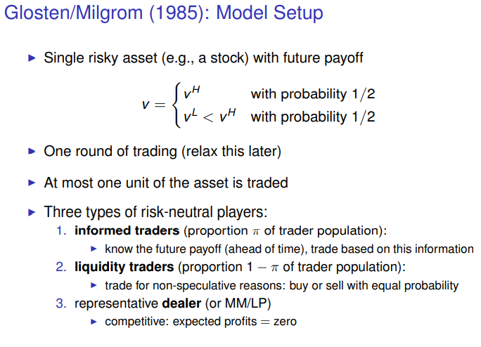
  - 한 라운드만 있음.
  - 한 개만 거래가 된다.
  - 참여자 종류
    - 미래 가치 아는 사람
    - 대표 딜러

- 
  - 1. ask bid 있음
  - 2. Trader는 informed나 liquidity trader 이다.
  - ask price
- 
  - bid price
- 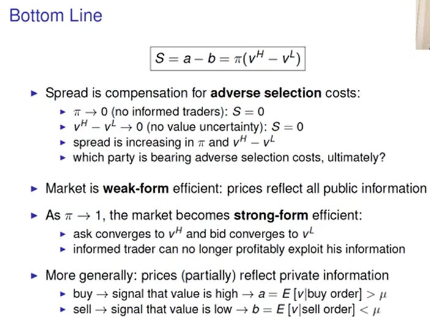
  - Spread는 adverse selection 에 대한 보상
  - 시장은 모든 공공 정보만들 반영 (weak-form efficient)
  - pi >> 1 strong form efficient이 된다.
- 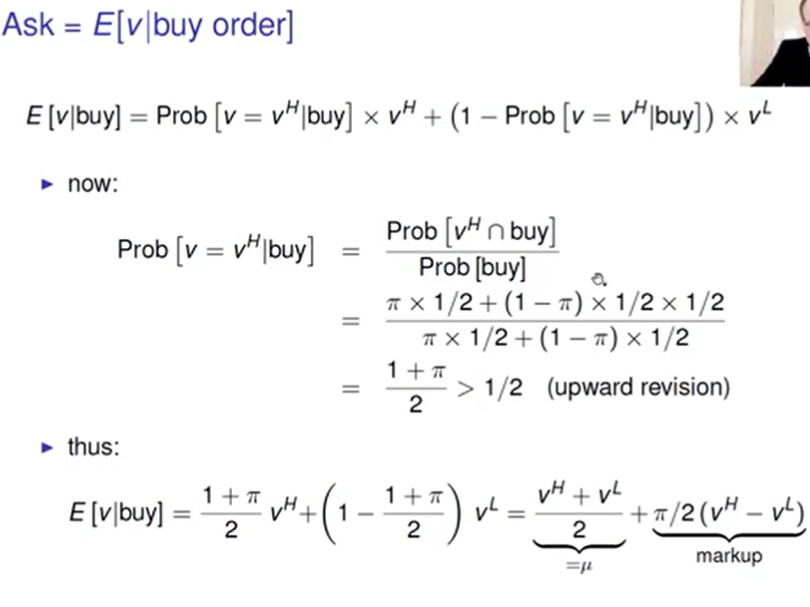
- 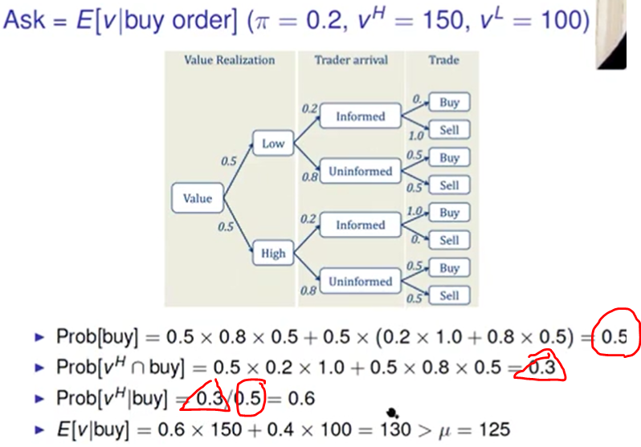
- 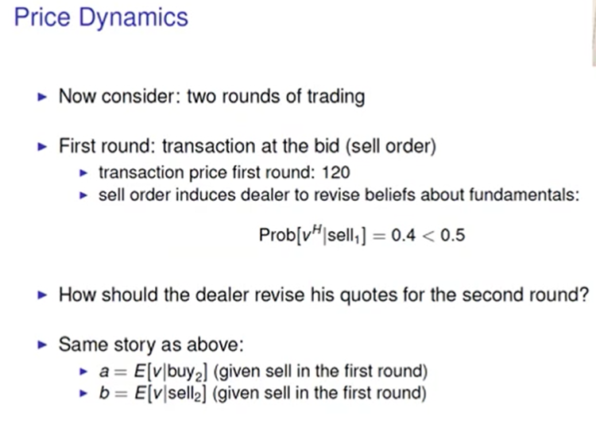
- 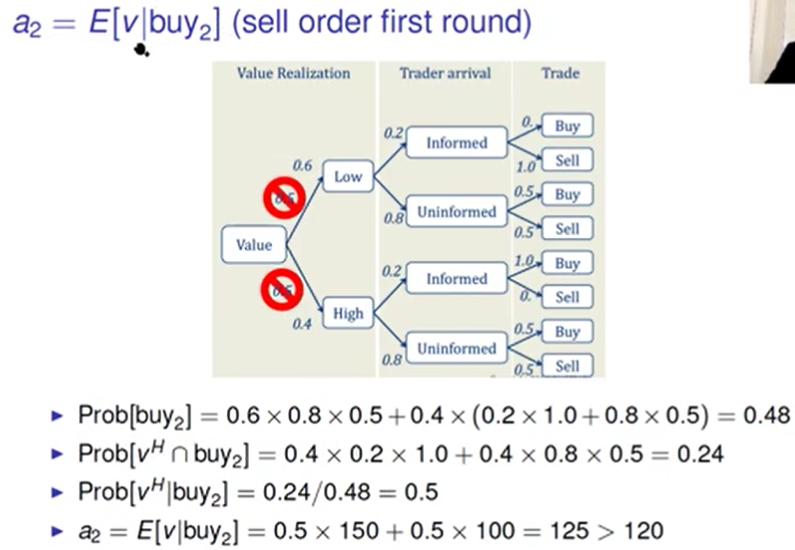
- 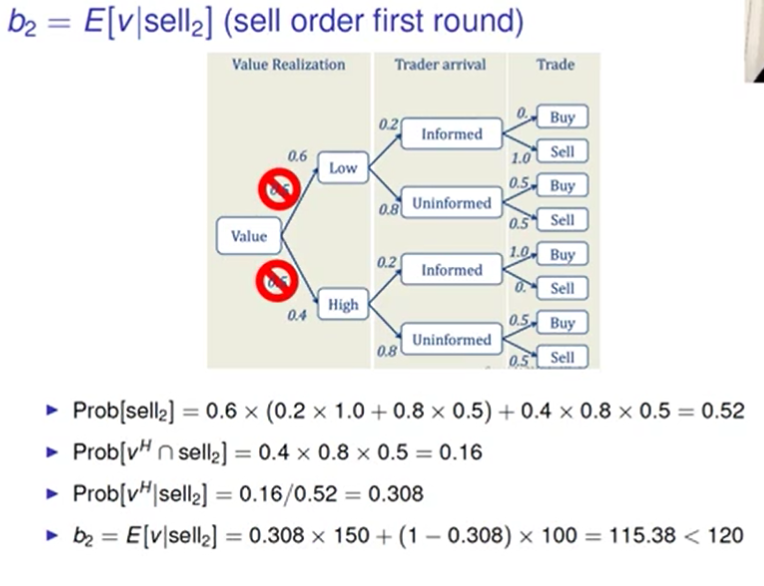
  - 1. 전체 판매할 확률
  - 2. v_h랑 sell일 확률
  - 3. v_H랑 sell일 확률/전체 판매할 확률
- 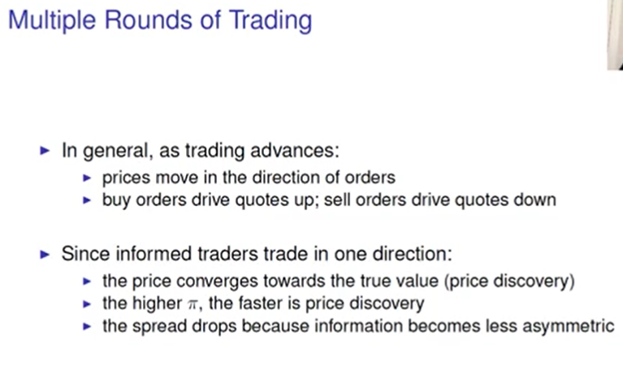
- 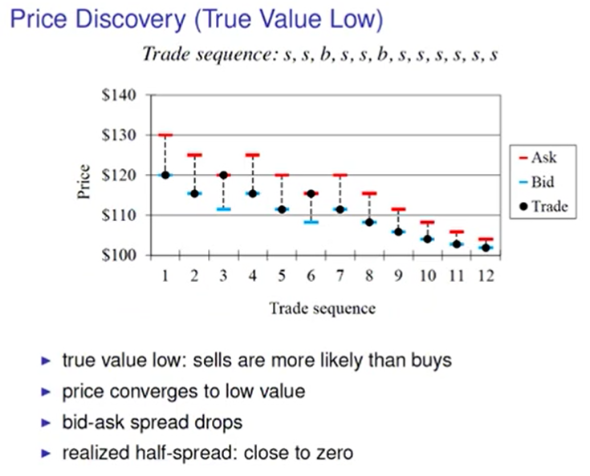
- 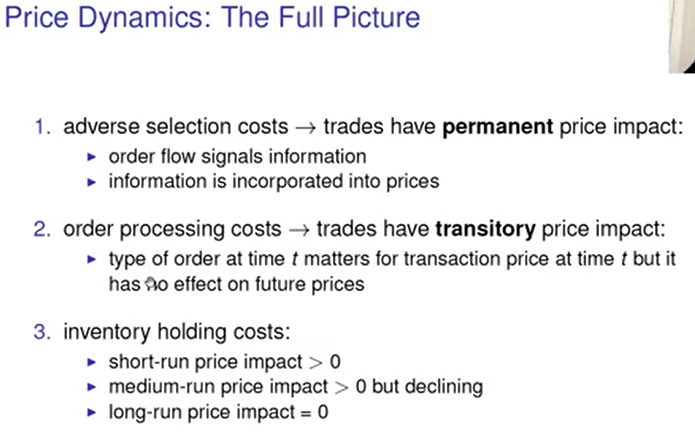
- 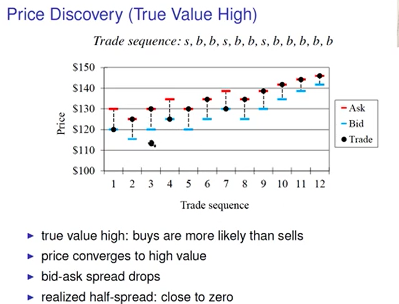
- 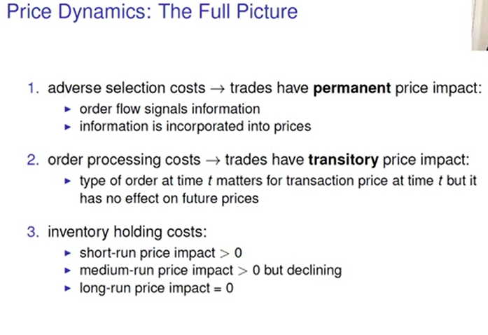
- 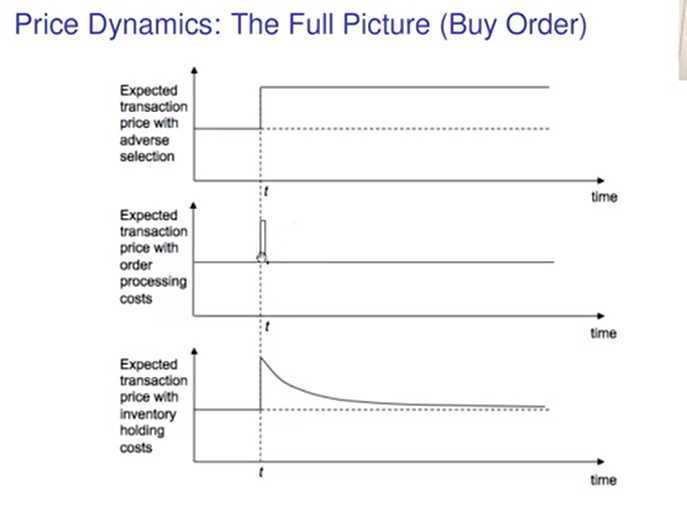
- 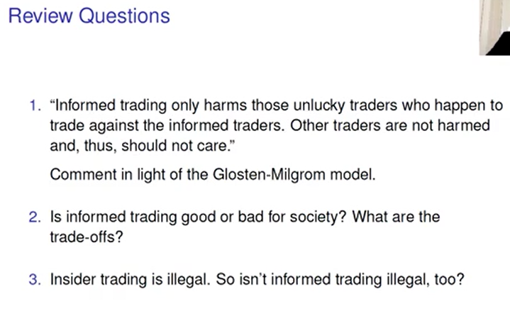
  - s
  - s
  - Not illegal
- 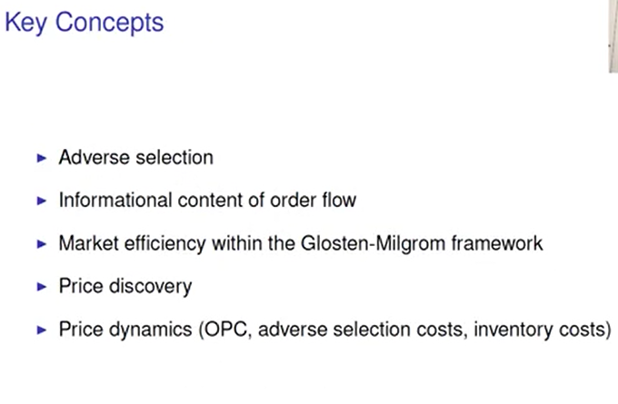